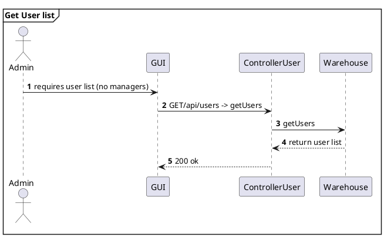
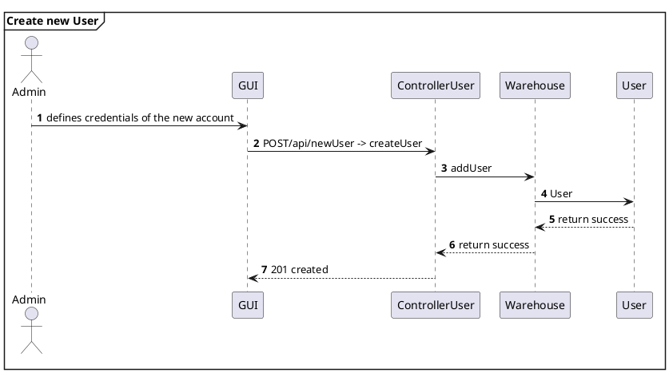
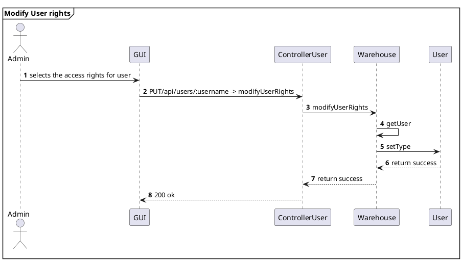
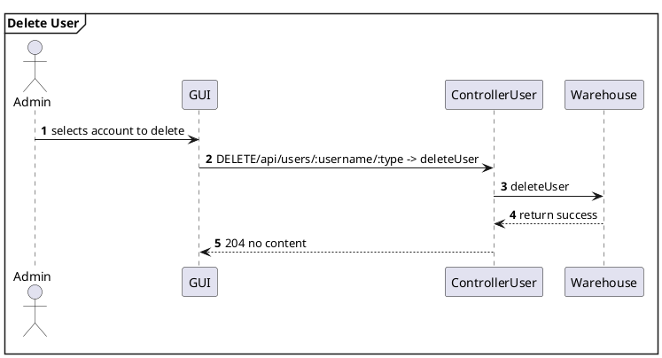
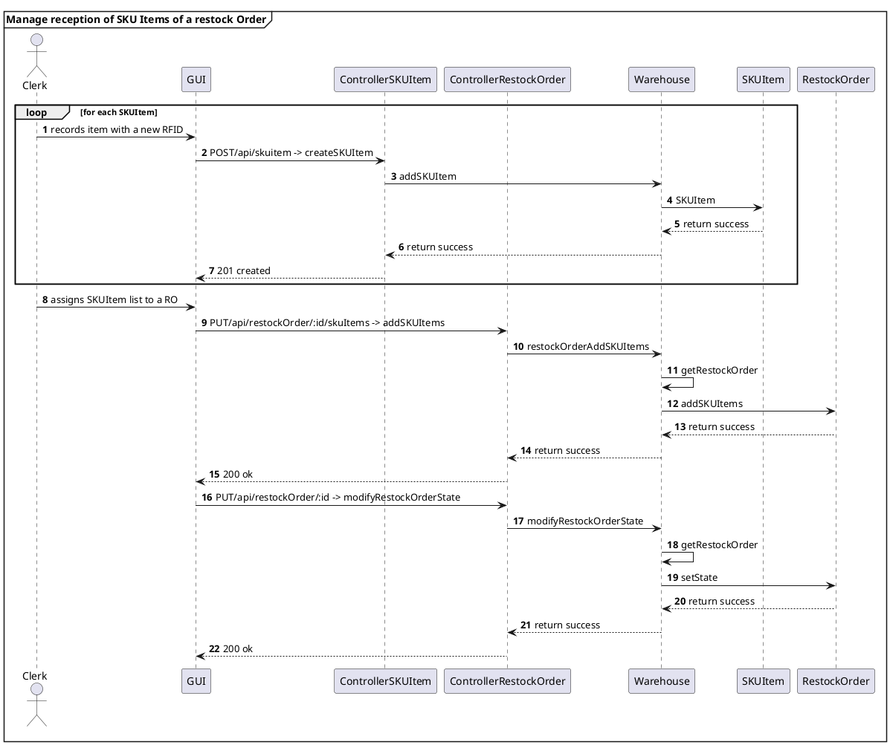
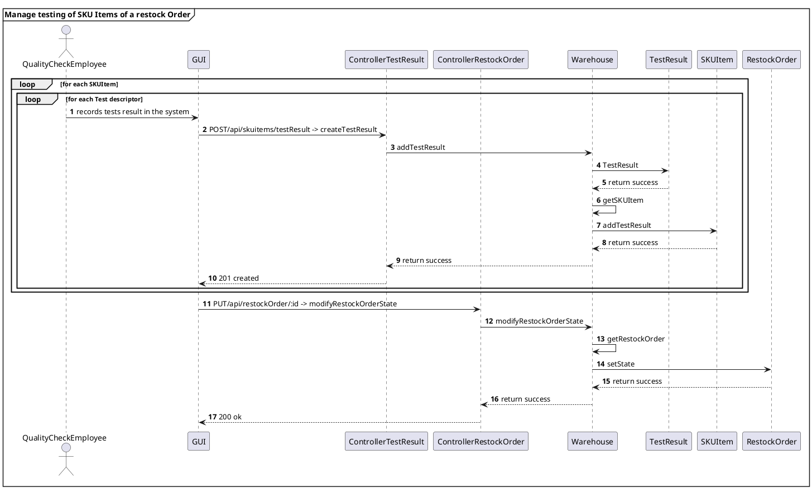
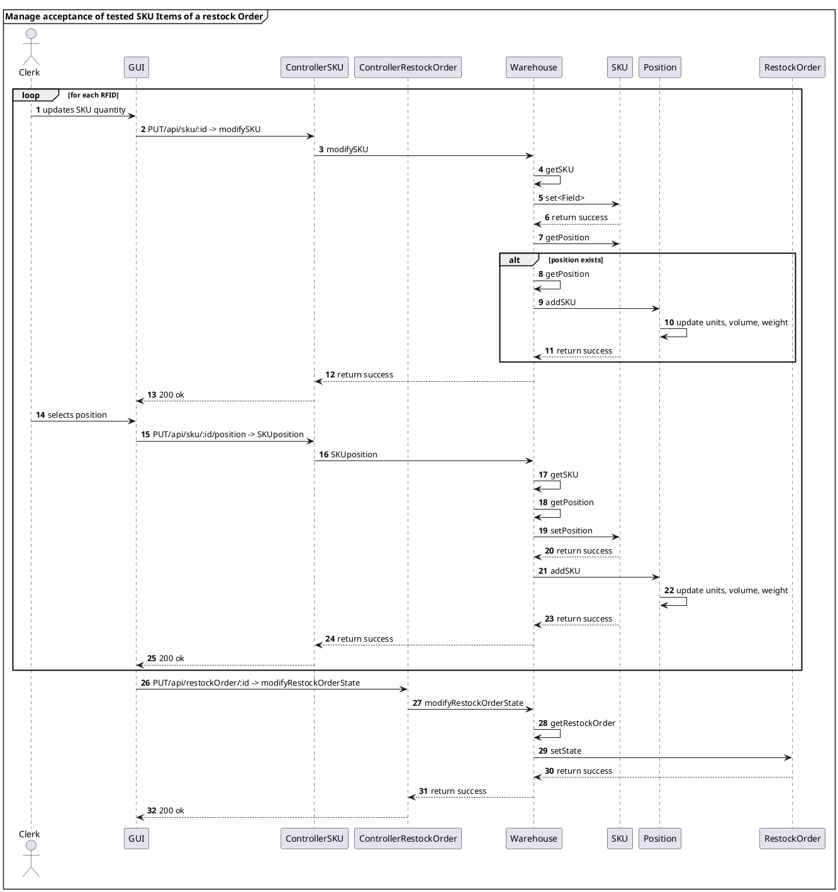
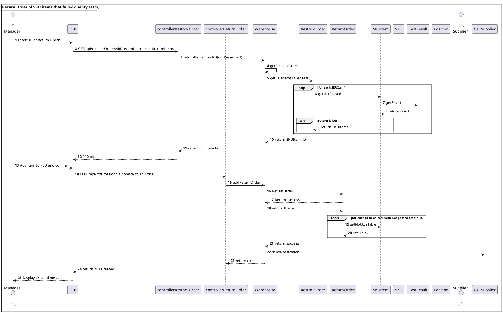

# Design Document 

Authors: 
Alessandro Zamparutti
Michele Pistan
Nicola di Gruttola Giardino
Nicolò Gallo

Date: 26 April 2022

Version: 2.0


# Contents

- [Design Document](#design-document)
- [Contents](#contents)
- [Instructions](#instructions)
- [High level design](#high-level-design)
- [Low level design](#low-level-design)
- [Verification traceability matrix](#verification-traceability-matrix)
- [Verification sequence diagrams](#verification-sequence-diagrams)
    - [Scenario 1.1](#scenario-11)
    - [Scenario 1.2](#scenario-12)
    - [Scenario 1.3](#scenario-13)
    - [Scenario 2.1](#scenario-21)
    - [Scenario 2.2](#scenario-22)
    - [Scenario 2.(3-4)](#scenario-23-4)
    - [Scenario 2.5](#scenario-25)
    - [Scenario 3.2](#scenario-32)
    - [Scenario 4.0](#scenario-40)
    - [Scenario 4.1](#scenario-41)
    - [Scenario 4.2](#scenario-42)
    - [Scenario 4.3](#scenario-43)
    - [Scenario 5.1.1](#scenario-511)
    - [Scenario 5.2.(1-2-3)](#scenario-521-2-3)
    - [Scenario 5.3.(1-3)](#scenario-531-3)
    - [Scenario 6.1](#scenario-61)
    - [Scenario 6.2](#scenario-62)
    - [Scenario 7.1](#scenario-71)
    - [Scenario 7.2](#scenario-72)
    - [Scenario 9.1](#scenario-91)
    - [Scenario 9.2](#scenario-92)
    - [Scenario 9.3](#scenario-93)
    - [Scenario 10.1](#scenario-101)
    - [Scenario 11.1](#scenario-111)
    - [Scenario 11.2](#scenario-112)
    - [Scenario 12.1](#scenario-121)
    - [Scenario 12.2](#scenario-122)
    - [Scenario 12.3](#scenario-123)

# Instructions

The design must satisfy the Official Requirements document 

# High level design 

The EZWH application follows the architectural pattern Model-View-Control. The View package contains the GUI, and it is given: so it is not descripted in this document. The class Warehouse is a facade for the classes in the Model package. We also used the Adapter Pattern: each Controller class is associated with a single API, it receives data from header and body of the HTTP request and transforms them in the format requested by the Warehouse class.

```plantuml
top to bottom direction

package "View" #DDDDDD {

}

'End of View

package "Controller" #DDDDDD {

}

'End of Controller

package "Model" #DDDDDD {

}

```

# Low level design


```plantuml
top to bottom direction

package "View" #DDDDDD {

class GUI

note " The Graphical User Interface is fixed\n and not designed in this Document " as N1  
N1 .. GUI
}

'End of View

```

```plantuml
package "Controller" #DDDDDD {

  class controllerSKU{
    createSKU(HTTPrequest) : Response
    getSKUs(HTTPrequest) : Response
    getSKUbyID(HTTPrequest) : Response
    modifySKU(HTTPrequest) : Response
    modifySKUposition(HTTPrequest) : Response
    deleteSKU(HTTPrequest) : Response
  }

  class controllerSKUItem {
    createSKUItem(HTTPrequest) : Response
    getSKUitems(HTTPrequest) : Response
    getSKUitemByRFID(HTTPrequest) : Response
    getSKUitemsBySKUid(HTTPrequest) : Response
    modifySKUItem(HTTPrequest) : Response
    deleteSKUItem(HTTPrequest) : Response
  }

  class ControllerPosition{
    createPosition(HTTPrequest) : Response
    getPositions(HTTPrequest) : Response
    modifyPosition(HTTPrequest) : Response
    modifyPositionID(HTTPrequest) : Response
    deletePosition(HTTPrequest) : Response
  }

  class controllerTestDescriptor {
    createTestDescriptor(HTTPrequest) : Response
    getTestDescriptors(HTTPrequest) : Response
    getTestDescriptorById(HTTPrequest) : Response
    modifyTestDescriptor(HTTPrequest) : Response
    deleteTestDescriptor(HTTPrequest) : Response
  }

  class controllerTestResult {
    createTestResult(HTTPrequest) : Response
    getTestResults(HTTPrequest) : Response
    getTestResultById(HTTPrequest) : Response
    modifyTestResult(HTTPrequest) : Response
    deleteTestResult(HTTPrequest) : Response
  }

  class controllerUser {
    createUser(HTTPrequest) : Response
    getUsers(HTTPrequest) : Response
    getAllSuppliers(HTTPrequest) : Response
    getUserInfo(HTTPrequest) : Response
    modifyUserRights(HTTPrequest) : Response
    logIn<userType>(HTTPrequest) : Response
    logOut(HTTPrequest) : Response
    deleteUser(HTTPrequest) : Response
  }

  class controllerRestockOrder{
    createRestockOrder(HTTPrequest) : Response
    getRestockOrdes(HTTPrequest) : Response
    getRestockOrdersIssued(HTTPrequest) : Response
    getReturnItems(HTTPrequest) : Response
    getRestockOrderById(HTTPrequest) : Response
    modifyRestockOrderState(HTTPrequest) : Response
    addSKUItems(HTTPrequest) : Response
    addTransportNote(HTTPrequest) : Response
    deleteRestockOrder(HTTPrequest) : Response
  }

  class controllerReturnOrder{
    createReturnOrder(HTTPrequest) : Response
    getReturnOrders(HTTPrequest) : Response
    getReturnOrderById(HTTPrequest) : Response
    deleteReturnOrder(HTTPrequest) : Response
  }

  class controllerInternalOrder{
    createInternalOrder(HTTPrequest) : Response
    getInternalOrdersIssued(HTTPrequest) : Response
    getAcceptedInternalOrders(HTTPrequest) : Response
    getInternalOrder(HTTPrequest) : Response
    setIOStatus(HTTPrequest) : Response
    deleteInternalOrder(HTTPrequest) : Response
  }

  class controllerItem {
    createItem(HTTPrequest) : Response
    getItems(HTTPrequest) : Response
    getItemsById(HTTPrequest) : Response
    modifyItem(HTTPrequest) : Response
    deleteItem(HTTPrequest) : Response
  }
  
}
'End of Controller
```

```plantuml

package "Model" #DDDDDD {

  class Warehouse{
      SKUlist : SKU [ ]
      SKUItemList : SKUItem [ ]
      PositionList : Position [ ]
      TestDescriptorList : TestDescriptor [ ]
      TestResultList : TestResult [ ]
      UserList : User [ ]
      RestockOrderList : RestockOrder [ ]
      ReturnOrderList : ReturnOrder []
      InternalOrderList : InternalOrder []
      ItemList : Item [ ]

      addSKU(description, weight, volume, notes, price, availableQuantity) : void
      getSKU(id) : SKU
      getSKUs() : SKU [ ]
      modifySKU(skuID, description, weight, volume, notes, price, availableQuantity) : void
      modifySKUposition(skuID, positionID) : void
      deleteSKU(skuID) : void

      addSKUItem(rfid, skuID, dateOfStock) : void
      getSKUItem(rfid) : SKUItem
      getSKUitems() : SKUItem [ ]
      getSKUitemsBySKUid(skuID) : SKUItem [ ]
      modifySKUItem(rfid) : void
      deleteSKUItem(rfid) : void

      addPosition(aisle, row, col, maxWeight, maxVolume) : void
      getPosition(positionID) : Position
      getPositions() : Position [ ]
      modifyPosition(positionID, aisle, row, col, maxWeight, maxVolume, occupiedWeight, occupiedVolume)
      modifyPositionID(oldPositionID, newPositionID) : void
      deletePosition(positionID) : void

      addTestDescriptor(SKU, name, description) : void
      getTestDescriptors() : TestDescriptor [ ]
      modifyTestDescriptor(ID, descriptor) : void
      getTestDescriptor(ID) : TestDescriptor
      deleteTestDescriptor(ID) : void

      addTestResult(rfid, testDescriptorID, date, result) : void
      getTestResults() : TestResult [ ]
      getTestResultById(ID) : TestResult
      modifyTestResult(ID, newID, newDate, newResult) : void
      deleteTestResult(ID) : void

      addUser(name, surname, email, password, type) : void
      getUsers() : User [ ]
      getUser(username) : User
      getSuppliers() : User [ ]
      modifyUserRights(username, oldType, newType) : void
      logIn(username, password) : bool
      logOut( ) : bool
      deleteUser(username) : void

      addRestockOrder(products, supplierID, issueDate) : void
      getRestockOrder(restockOrderID) : RestockOrder
      getRestockOrders() : RestockOrder [ ]
      getRestockOrdersIssued() : RestockOrder [ ]
      restockOrderAddSKUItems(restockOrderID, SKUItemIdList) : void
      restockOrderAddTransportNote(restockOrderID, Date) : void
      modifyRestockOrderState(restockOrderID, newState) : void
      returnItemsFromRO(restockOrderID, notPassed : bool) : SKUItem[ ]
      deleteRestockOrder(restockOrderID) : void

      addReturnOrder(SKUItemList, restockOrderId, returnDate) : void
      getReturnOrders() : ReturnOrder [ ]
      getReturnOrderById(ID) : ReturnOrder
      deleteReturnOrder(ID) : void
      sendNotificationRO(userID, returnOrderID)

      addInternalOrder(products, customerID, issueDate) : int
      getInternalOrdersIssued() : InternalOrder [ ]
      getAcceptedInternalOrders() : InternalOrder[ ]
      getInternalOrder(ID) : InternalOrder
      setIOStatus(ID, status) : bool
      deleteInternalOrder(ID) : void

      addItem(id, description, price, associatedSKU, supplier) : void
      getItems() : Item [ ]
      getItem(itemID) : Item
      modifyItem(ID, description, price) : void
      deleteItem(itemID) : void
  }

  class SKU {
    id : int
    description : string
    weight : float
    volume : float
    notes : string
    position : Position
    availableQuantity : int
    price : double
    testDescriptors : TestDescriptor [ ]

    SKU(description, weight, volume, notes, price, availableQuantity) : SKU
    getID( ) : int
    getDescription( ) : string
    getWeight( ) : float
    getVolume( ) : float
    getNotes( ) : string
    getAvailableQuantity( ) : int
    getPrice( ) : double
    getPosition( ) : Position
    setDescription(description) : void
    setWeight(weight) : void
    setVolume(volume) : void
    setNotes(notes) : void
    setPosition(position) : void
    setAvailableQuantity(quantity) : void
    setPrice(price) : void
    decreaseAvailableQty(num) : bool
    increaseAvailableQty(num) : bool
  }

  class SKUItem {
    RFID : string
    available : boolean
    sku : SKU
    DateOfStock : DateTime
    testResults : TestResult [ ]

    SKUItem(rfid, skuID, dateOfStock) : SKUItem
    getRFID( ) : string
    getSKU( ) : SKU
    getDateOfStock( ) : DateTime
    setRFID(rfid) ; void
    setAvailable(available) : void
    setDateOfStock(date) : void
    isAvailable( ) : bool
    addTestResult(TestResult) : void
  }

  class Position {
    positionID : string
    aisle : string
    row : string
    col : string
    maxWeight : float
    maxVolume : float
    occupiedWeight : float
    occupiedVolume : float
    assignedSKU : SKU
    presentQty : int
    
    Position(aisle, row, col, maxWeight, maxVolume) : Position
    getPositionID( ) : string
    getAisle( ) : string
    getRow( ) : string
    getCol( ) : string
    getMaxWeight( ) : float
    getMaxVolume( ) : float
    geOccupiedtWeight( ) : float
    getOccupiedVolume( ) : float
    setPositionID(positionID) : void
    setPositionAisleRowCol(aisle, row, col) : void
    setMaxWeight(maxWeight) : void
    setMaxVolume(maxVolume) : void
    setOccupiedWeight(weight) : void
    setOccupiedVolume(volume) : void
    addSKU(sku) : bool
    increaseAvailablePos(num) : bool
    decreaseAvailablePos(num) : bool
  }

  class TestDescriptor {
    id : string
    name : string
    procedureDescription : string

    TestDescriptor(ID, sku, name, procedureDescription) : TestDescriptor
    getID( ) : string
    getName( ) : string
    getProcedureDescription( ) : string
    setName(name) : void
    setProcedureDescription(description) : void
  }

  class TestResult {
    id : int
    testDescriptor : TestDescriptor
    date : DateTime
    result : boolean

    TestResult(testDescriptor, date, result) : TestResult
    getID( ) : int
    getTestDescriptor( ) : TestDescriptor
    getDate( ) : Date
    getResult( ) : bool
    setID(id) : void
    setDate(date) : void
    setResult(result) : void
  }

  class User {
    userID : int
    name : string
    surname : string
    email : string
    password : string
    type : string
    type [Manager, Admin, Supplier, Clerk, QualityCheckEmployee, DeliveryEmployee, InternalCustomer]

    User(name, surname, email, password, type) : User
    getUserID( ) : int
    getName( ) : string
    getSurname( ) : string
    getEmail( ) : string
    getType( ) : string
    setType(newType) : void
  }

  class RestockOrder {
    id : int
    issueDate : DateTime
    products : Map <Item, int>
    supplier : User
    transportNote : TransportNote
    SKUitems : SKUItem [ ]
    state : string
    state [ISSUED - DELIVERY - DELIVERED - TESTED - COMPLETEDRETURN - COMPLETED]
    
    RestockOrder(supplierID, issueDate) : RestockOrder
    getID( ) : int
    getIssueDate( ) : DateTime
    getProducts( ) : Map <Item, int>
    getState( ) : string
    getTransportNote( ) : TransportNote
    getSKUitems( ) : SKUItem [ ]
    getSupplier( ) : User
    addProduct(item, description, qty) : void
    addSKUItems(skuItemList) : void
    setState(newState) : void
    getSKUItemsFailedTest() : SKUItem[]
  }

  class TransportNote {
    shipmentDate : DateTime

    TransportNote(date) : TransportNote
    getShipmentDate( ) : DateTime
  }

  class ReturnOrder {
    id : int
    returnDate : DateTime
    restockOrder : RestockOrder
    products : SKUItem [ ]

    ReturnOrder(restockOrder, returnDate) : ReturnOrder
    getID( ) : int
    getReturnDate( ) : DateTime
    getProducts( ) : SKUItem [ ]
    getRestockOrder( ) : RestockOrder
    addSKUItems(SKUItems) : bool
  }

  class InternalOrder {
    id : int
    issueDate : DateTime
    products : Map <SKU, int>
    deliveredProducts : SKUItem [ ]    
    internalCustomer : User
    state : string
    state [ISSUED - ACCEPTED - REFUSED - CANCELED - COMPLETED]

    InternalOrder(customer, issueDate) : InternalOrder
    getID( ) : int
    getIssueDate( ) : DateTime
    getProducts( ) : Map <SKU, int>
    getDeliveredProducts( ) : SKUItem [ ]
    getState( ) : string
    addSKU(SKU, qty) : bool
    addDeliveredProducts(SKUItemList) : void
    setStatus(status) : bool 
  }

  class Item {
    ID : int
    description : string
    price : double
    associatedSKU : SKU
    supplier : User

    Item(ID, description, price, associatedSKU, supplier) : Item
    getID( ) : int
    getDescription( ) : string
    getPrice( ) : double
    getAssociatedSKU( ) : SKU
    gerSupplier( ) : User
    setDescription(description) : void
    setPrice(price) : void
    setAssociatedSKU(SKU) : void
    setSupplier(supplier) : void
  }  
}
Warehouse -- "*" SKU
Warehouse -- "*" SKUItem
Warehouse -- "*" TestDescriptor
Warehouse -- "*" TestResult
Warehouse -- "*" User
Warehouse -- "*" RestockOrder
Warehouse -- "*" ReturnOrder
Warehouse -- "*" InternalOrder
Warehouse -- "*" Item
Warehouse -- "*" Position
RestockOrder -- "*" Item
RestockOrder -- "0..1" TransportNote
RestockOrder -- "0..1" ReturnOrder : refers
RestockOrder -- "*" SKUItem
SKUItem "*" -- "0..1" ReturnOrder
SKU -- "*" SKUItem
SKU -- "*" Item : corresponds to 
SKU "*" -- "*" TestDescriptor
TestDescriptor -- "*" TestResult
SKU "1" -- "1" Position: must be placed in
InternalOrder -- "*" SKU
InternalOrder "0..1" -- "*" SKUItem
SKUItem -- "*" TestResult
SKUItem "*" -- "0..1" Position

```


# Verification traceability matrix

For each functional requirement from the requirement document, this table shows which classes concur to implement it.

| FR / Class |  ControllerSKU | ControllerSKUItem | ControllerPosition | ControllerTestDescriptor | ControllerTestResult | ControllerUser | ControllerRestockOrder | ControllerReturnOrder | ControllerInternalOrder | ControllerItem | Warehouse | SKU | SKUItem | Position | TestDescriptor | TestResult | User | RestockOrder | ReturnOrder | InternalOrder | Item |
| :--------- | :---: | :---: | :---: | :---: | :---: | :---: | :---: | :---: | :---: | :---: | :---: | :---: | :---: | :---: | :---: | :---: | :---: | :---: | :---: | :---: | :---: |
| FR1 | | | | | | X | | | | | X | | | | | | X | | | | |
| FR2 | X | | | | | | | | | | X | X | | | | | | | | | |
| FR3.1 | | | X | | | | | | | | X | | | X | | | | | | | |
| FR3.2 | | | | X | X | | | | | | X | | | | X | X | | | | | |
| FR4 | | | | | | X | | | | | X | | | | | | X | | | | |
| FR5 | | X | | | | | X | X | | | X | | X | | | | | X | X | | |
| FR6 | | | | | | | | | X | | X | | X | | | | | | | X | |
| FR7 | | | | | | | | | | X | X | | | | | | | | | | X |


# Verification sequence diagrams

### Scenario 1.1
```plantuml
mainframe **Create SKU**
actor Manager
participant GUI
participant ControllerSKU
participant Warehouse
participant SKU

autonumber
Manager -> GUI : inserts data
GUI -> ControllerSKU : POST/api/sku -> createSKU
ControllerSKU -> Warehouse : addSKU
Warehouse -> SKU : SKU
Warehouse <-> SKU : return success
ControllerSKU <-- Warehouse : return success
GUI <-- ControllerSKU : 201 created

@enduml
```

### Scenario 1.2
```plantuml
mainframe **Modify SKU location**
actor Manager
participant GUI
participant ControllerSKU
participant ControllerPosition
participant Warehouse
participant SKU

autonumber
Manager -> GUI : inserts SKU ID
GUI -> ControllerSKU :  GET/api/skus/:id -> getSKUbyID
ControllerSKU -> Warehouse : getSKU
ControllerSKU <-- Warehouse : return SKU
GUI <-- ControllerSKU : 200 ok

Manager -> GUI : selects SKU record
GUI -> ControllerPosition : GET/api/positions -> getPositions
ControllerPosition -> Warehouse : getPositions
ControllerPosition <-- Warehouse : return Position list
GUI <-- ControllerPosition : 200 ok

Manager -> GUI : selects SKU position
GUI -> ControllerSKU : PUT/api/sku/:id/position -> modifySKUposition
ControllerSKU -> Warehouse : modifySKUposition
Warehouse -> Warehouse : getSKU
Warehouse -> Warehouse : getPosition
Warehouse -> SKU : setPosition
Warehouse <-- SKU : return success
Warehouse -> Position : addSKU
Position -> Position : update volume, weight
Warehouse <-- Position : return success
ControllerSKU <-- Warehouse : return success
GUI <-- ControllerSKU : 200 ok

@enduml
```

### Scenario 1.3
```plantuml
mainframe **Modify SKU weight and volume**
actor Manager
participant GUI
participant ControllerSKU
participant Warehouse
participant SKU

autonumber
Manager -> GUI : inserts SKU ID
GUI -> ControllerSKU :  GET/api/skus/:id -> getSKUbyID
ControllerSKU -> Warehouse : getSKU
ControllerSKU <-- Warehouse : return SKU
GUI <-- ControllerSKU : 200 ok

Manager -> GUI : inserts data
GUI -> ControllerSKU : PUT/api/sku/:id -> modifySKU
  ControllerSKU -> Warehouse : modifySKU
  Warehouse -> Warehouse : getSKU
  Warehouse -> SKU : set<Field>
  Warehouse <-- SKU : return success
  Warehouse -> SKU : getPosition
  alt position exists
    Warehouse -> Warehouse : getPosition
    Warehouse -> Position : addSKU
    Position -> Position : update volume, weight
    Warehouse <-- SKU : return success
  end alt  
ControllerSKU <-- Warehouse : return success
GUI <-- ControllerSKU : 200 ok

@enduml
```

### Scenario 2.1
```plantuml
mainframe **Create Position**
actor Manager
participant GUI
participant ControllerPosition
participant Warehouse
participant Position

autonumber
Manager -> GUI : inserts data
GUI -> ControllerPosition : POST/api/position -> createPosition
ControllerPosition -> Warehouse : addPosition
Warehouse -> Position : Position
Warehouse <-- Position : return success
ControllerPosition <-- Warehouse : return success
GUI <-- ControllerPosition : 201 created

@enduml
```

### Scenario 2.2
```plantuml
mainframe **Modify positionID**
actor Manager
participant GUI
participant ControllerPosition
participant Warehouse
participant Position

autonumber
Manager -> GUI : show list of positions
GUI -> ControllerPosition : GET/api/positions -> getPositions
ControllerPosition -> Warehouse : getPositions
ControllerPosition <-- Warehouse : return Position list
GUI <-- ControllerPosition : 200 ok

Manager -> GUI : inserts new PositionID
GUI -> ControllerPosition : PUT/api/position/:positionID/changeID -> modifyPositionID
ControllerPosition -> Warehouse : modifyPositionID
Warehouse -> Warehouse : getPosition
Warehouse -> Position : setPositionID
Position -> Position : update Aisle Row Col
Warehouse <-- Position : return success
ControllerPosition <-- Warehouse : return success
GUI <-- ControllerPosition : 200 ok

@enduml
```

### Scenario 2.(3-4)
```plantuml
mainframe **Modify weight and volume or aisle ID, row and column of Position**
actor Manager
participant GUI
participant ControllerPosition
participant Warehouse
participant Position

autonumber
Manager -> GUI : selects position and inserts data
GUI -> ControllerPosition : PUT/api/position/:positionID-> modifyPosition
ControllerPosition -> Warehouse : modifyPosition
Warehouse -> Warehouse : getPosition
Warehouse -> Position : setPositionAisleRowCol
Position -> Position : update positionID
Warehouse <-- Position : return success
Warehouse -> Position : set<Field>
Warehouse <-- Position : return succes
ControllerPosition <-- Warehouse : return success
GUI <-- ControllerPosition : 200 ok

@enduml
```

### Scenario 2.5
```plantuml
mainframe **Delete Position**
actor Manager
participant GUI
participant ControllerPosition
participant Warehouse

autonumber
Manager -> GUI : delete positions selected
GUI -> ControllerPosition : DELETE/api/position/:positionID -> deletePosition
ControllerPosition -> Warehouse : deletePosition
ControllerPosition <-- Warehouse : return success
GUI <-- ControllerPosition : 204 No Content

@enduml
```

### Scenario 3.2
```plantuml
mainframe **Restock Order of SKU S issued by supplier**
actor Manager
participant GUI
participant ControllerUser
participant ControllerRestockOrder
participant Warehouse
participant RestockOrder

autonumber
Manager -> GUI :  show list of Supplier
GUI -> ControllerUser : GET/api/suppliers -> getAllSuppliers
ControllerUser -> Warehouse : getSuppliers
ControllerUser <-- Warehouse : return Supplier list
GUI <-- ControllerUser : 200 ok

Manager -> GUI : select Items
GUI -> ControllerRestockOrder : GET/api/items -> getItems
ControllerRestockOrder -> Warehouse : getItems
ControllerRestockOrder <-- Warehouse : return Item list
GUI <-- ControllerRestockOrder : return 200 ok
GUI -> ControllerRestockOrder : GET/api/items/:id -> getItemById
ControllerRestockOrder -> Warehouse : getItem
ControllerRestockOrder <-- Warehouse : return Item
GUI <-- ControllerRestockOrder : return 200 ok

Manager -> GUI : inserts data
GUI -> ControllerRestockOrder : POST/api/restockOrder -> createRestockOrder
ControllerRestockOrder -> Warehouse : addRestockOrder
Warehouse -> RestockOrder : RestockOrder
Warehouse <-- RestockOrder : return success
ControllerRestockOrder <-- Warehouse : return success
GUI <-- ControllerRestockOrder : 201 Created

@enduml
```

### Scenario 4.0


### Scenario 4.1


### Scenario 4.2


### Scenario 4.3

### Scenario 5.1.1


### Scenario 5.2.(1-2-3)


### Scenario 5.3.(1-3)


### Scenario 6.1


<!-- da cancellare -->
### Scenario 6.2
```plantuml
@startuml
mainframe **Return Order of any SKU items**
actor Manager 
participant GUI
participant controllerRestockOrder
participant controllerReturnOrder
participant Warehouse
participant RestockOrder
participant ReturnOrder
participant SKUItem
participant SKU
participant TestResult
participant Position
actor Supplier

autonumber
Manager -> GUI : insert ID of RestockOrder
GUI -> controllerRestockOrder : GET/api/restockOrders/:id/returnItems -> getReturnItems
controllerRestockOrder -> Warehouse : returnItemsFromRO(notPassed = 0)
Warehouse -> Warehouse : getRestockOrder
Warehouse -> RestockOrder : getSKUItemsFailedTest
loop for each SKUItem
  RestockOrder -> SKUItem : getNotPassed
  SKUItem -> TestResult : getResult
  SKUItem <-- TestResult : return result
  alt return false
    RestockOrder <-- SKUItem : return RFID
  else 
      SKUItem -> SKUItem : checkIfReturn
        alt return true
          RestockOrder <-- SKUItem : return RFID
        end alt
  end alt
end loop

RestockOrder --> controllerRestockOrder : return listSKUs
controllerRestockOrder --> GUI : return RFID of SKUs

Manager -> GUI : Add item to REO and confirm
GUI -> controllerReturnOrder : POST/api/returnOrder -> createReturnOrder
controllerReturnOrder -> Warehouse : addReturnOrder
Warehouse -> ReturnOrder : ReturnOrder
Warehouse <-- ReturnOrder : Return success  
Warehouse -> ReturnOrder : addSKUItems 
loop for each RFID of item with not passed test in RO
  ReturnOrder -> SKUItem : setNotAvailable
  ReturnOrder <-- SKUItem : return ok
end loop
Warehouse <-- ReturnOrder : return success
Warehouse -> GUISupplier : sendNotification
Warehouse --> controllerReturnOrder : return ok
controllerReturnOrder --> GUI : return 201 Created
GUI --> Manager : Display Created message
@enduml

```

### Scenario 7.1
```plantuml
@startuml
mainframe **LogIn**
actor User
participant GUI
participant controllerUser
participant Warehouse

autonumber
User -> GUI : insert Username and Password
User -> GUI : click Login
GUI -> controllerUser : POST/api/userSessions -> logIn
controllerUser -> Warehouse : logIn
alt Credentials are Ok
  controllerUser <- Warehouse : return true
  GUI <-- controllerUser : return 200 Ok
  User <-- GUI : display homepage
else Credentials are wrong
  controllerUser <- Warehouse : return false
  GUI <-- controllerUser : return 401 Unauthorized
  User <-- GUI : display Error Message
end
@enduml
```

### Scenario 7.2
```plantuml
@startuml
mainframe **LogOut**
actor User
participant GUI
participant controllerUser
participant Warehouse

autonumber
User -> GUI : click on Logout
GUI -> controllerUser : POST/api/logout -> logOut
controllerUser -> Warehouse : logOut
controllerUser <-- Warehouse : return ok
GUI <-- controllerUser : return 200 Ok
User <-- GUI : display Login page
@enduml
```

### Scenario 9.1
```plantuml
@startuml
mainframe **Internal Order accepted**
actor Customer
actor Manager
participant GUI
participant controllerInternalOrder
participant Warehouse
participant InternalOrder
participant SKU

autonumber
Customer -> GUI : start internal order and add SKUs
GUI -> controllerInternalOrder : POST/api/internalOrders -> createInternalOrder 
controllerInternalOrder -> Warehouse : addInternalOrder
Warehouse -> InternalOrder : InternalOrder
Warehouse <-- InternalOrder : return success
loop for each SKU needed
  Warehouse -> InternalOrder : addSKU(qty)
  Warehouse <-- InternalOrder : return ok
end loop
controllerInternalOrder <-- Warehouse : return ok
GUI <-- controllerInternalOrder : return 201 Created

Customer -> GUI : confirm IO
GUI -> controllerInternalOrder : PUT/api/internalOrders/:id {ISSUED} -> setIOStatus
controllerInternalOrder -> Warehouse : setIOStatus(id,ISSUED)
Warehouse -> InternalOrder : setStatus(ISSUED)
loop for each SKU in IO
  InternalOrder -> SKU : decreaseAvailableQty
  SKU -> Position : increaseAvailablePos
  SKU <-- Position : return ok
  InternalOrder <-- SKU : return ok
end loop
Warehouse <-- InternalOrder : return ok
controllerInternalOrder <-- Warehouse : return ok
GUI <-- controllerInternalOrder : return 200 OK

Manager -> GUI : check IO
GUI -> controllerInternalOrder : GET/api/internalOrdersIssued -> getInternalOrdersIssued
controllerInternalOrder -> Warehouse : getInternalOrdersIssued
controllerInternalOrder <-- Warehouse : return list issued
GUI <-- controllerInternalOrder : return 200 OK
Manager <-- GUI : display Issued orders

Manager -> GUI : confirm IO
GUI -> controllerInternalOrder : PUT/api/internalOrders/:id {ACCEPTED} -> setIOStatus
controllerInternalOrder -> Warehouse : setIOStatus(id,ACCEPTED)
Warehouse -> InternalOrder : setStatus(ACCEPTED)
Warehouse <-- InternalOrder : return ok
controllerInternalOrder <-- Warehouse : return ok
GUI <-- controllerInternalOrder : return 200 OK
@enduml
```

### Scenario 9.2
```plantuml
@startuml
mainframe **Internal Order refused**
actor Customer
actor Manager
participant GUI
participant controllerInternalOrder
participant Warehouse
participant InternalOrder
participant SKU

autonumber
Customer -> GUI : start internal order and add SKUs
GUI -> controllerInternalOrder : POST/api/internalOrders -> createInternalOrder 
controllerInternalOrder -> Warehouse : addInternalOrder
Warehouse -> InternalOrder : InternalOrder
Warehouse <-- InternalOrder : return success
loop for each SKU needed
  Warehouse -> InternalOrder : addSKU(qty)
  Warehouse <-- InternalOrder : return ok
end loop
controllerInternalOrder <-- Warehouse : return ok
GUI <-- controllerInternalOrder : return 201 Created

Customer -> GUI : confirm IO
GUI -> controllerInternalOrder : PUT/api/internalOrders/:id {ISSUED} -> setIOStatus
controllerInternalOrder -> Warehouse : setIOStatus(id,ISSUED)
Warehouse -> InternalOrder : setStatus(ISSUED)
loop for each SKU in IO
  InternalOrder -> SKU : decreaseAvailableQty
  SKU -> Position : increaseAvailablePos
  SKU <-- Position : return ok
  InternalOrder <-- SKU : return ok
end loop
Warehouse <-- InternalOrder : return ok
controllerInternalOrder <-- Warehouse : return ok
GUI <-- controllerInternalOrder : return 200 OK

Manager -> GUI : check IO
GUI -> controllerInternalOrder : GET/api/internalOrdersIssued -> getInternalOrdersIssued
controllerInternalOrder -> Warehouse : getInternalOrdersIssued
controllerInternalOrder <-- Warehouse : return list issued
GUI <-- controllerInternalOrder : return 200 OK
Manager <-- GUI : display Issued orders

Manager -> GUI : refuse IO
GUI -> controllerInternalOrder : PUT/api/internalOrders/:id {REFUSED} -> setIOStatus
controllerInternalOrder -> Warehouse : setIOStatus(id,REFUSED)
Warehouse -> InternalOrder : setStatus(REFUSED)
Warehouse <-- InternalOrder : return ok
controllerInternalOrder <-- Warehouse : return ok
GUI <-- controllerInternalOrder : return 200 OK
@enduml
```

### Scenario 9.3
```plantuml
@startuml
mainframe **Internal Order cancelled**
actor Customer
participant GUI
participant controllerInternalOrder
participant Warehouse
participant InternalOrder
participant SKU

autonumber
Customer -> GUI : start internal order and add SKUs
GUI -> controllerInternalOrder : POST/api/internalOrders -> createInternalOrder 
controllerInternalOrder -> Warehouse : addInternalOrder
Warehouse -> InternalOrder : InternalOrder
Warehouse <-- InternalOrder : return success
loop for each SKU needed
  Warehouse -> InternalOrder : addSKU(qty)
  Warehouse <-- InternalOrder : return ok
end loop
controllerInternalOrder <-- Warehouse : return ok
GUI <-- controllerInternalOrder : return 201 Created

Customer -> GUI : confirm IO
GUI -> controllerInternalOrder : PUT/api/internalOrders/:id {ISSUED} -> setIOStatus
controllerInternalOrder -> Warehouse : setIOStatus(id,ISSUED)
Warehouse -> InternalOrder : setStatus(ISSUED)
loop for each SKU in IO
  InternalOrder -> SKU : decreaseAvailableQty
  SKU -> Position : increaseAvailablePos
  SKU <-- Position : return ok
  InternalOrder <-- SKU : return ok
end loop
Warehouse <-- InternalOrder : return ok
controllerInternalOrder <-- Warehouse : return ok
GUI <-- controllerInternalOrder : return 200 OK

Customer -> GUI : delete IO
GUI -> controllerInternalOrder : PUT/api/internalOrders/:id {CANCELED} -> setIOStatus
controllerInternalOrder -> Warehouse : setIOStatus(id,CANCELED)
Warehouse -> InternalOrder : setStatus(CANCELED)
loop for each SKU in IO
  InternalOrder -> SKU : increaseAvailableQty
  SKU -> Position : decreaseAvailablePos
  SKU <-- Position : return ok
  InternalOrder <-- SKU : return ok
end loop
Warehouse <-- InternalOrder : return ok
controllerInternalOrder <-- Warehouse : return ok
GUI <-- controllerInternalOrder : return 200 OK
@enduml
```

### Scenario 10.1
```plantuml
@startuml
mainframe **Internal Order completed**
actor DeliveryEmployee
participant GUI
participant controllerInternalOrder
participant InternalOrder
participant ControllerSKUItem
participant SKUItem

autonumber
DeliveryEmployee -> GUI : get accepted internal orders
GUI -> controllerInternalOrder : GET/api/inernalOrdersAccepted -> getAcceptedInternalOrders
controllerInternalOrder -> Warehouse : getAcceptedInternalOrders
controllerInternalOrder <-- Warehouse : return IO list
GUI <-- controllerInternalOrder : return IO list
GUI <-- controllerInternalOrder : 200 OK
DeliveryEmployee -> GUI : select internal order
GUI -> controllerInternalOrder : GET/api/internalOrders/:id -> getInternalOrder
controllerInternalOrder -> Warehouse : getInternalOrder
controllerInternalOrder <-- Warehouse : return IO
GUI <-- controllerInternalOrder : 200 OK
loop for each SKUitem set not available
  GUI -> ControllerSKUItem : PUT/api/skuitems/:rfid -> modifySKUItem
  ControllerSKUItem -> Warehouse : modifySKUItem
  Warehouse -> Warehouse : getSKUItem
  Warehouse -> SKUItem : set<Field>
  Warehouse <-- SKUItem : return ok
  ControllerSKUItem <-- Warehouse : return ok
  GUI <-- ControllerSKUItem : 200 OK
end loop

GUI -> controllerInternalOrder : PUT/api/internalOrders/:id {COMPLETED} -> setIOStatus
controllerInternalOrder -> Warehouse : setIOStatus(id,COMPLETED)
Warehouse -> InternalOrder : setStatus(COMPLETED)
Warehouse <-- InternalOrder : return ok
controllerInternalOrder <-- Warehouse : return ok
GUI <-- controllerInternalOrder : return 200 OK
@enduml
```

### Scenario 11.1
```plantuml
@startuml
mainframe **Create Item**
actor Supplier
participant GUI
participant ControllerItem
participant Warehouse
participant Item

autonumber
Supplier -> GUI : insert description, SKUid, price 
GUI -> ControllerItem : POST/api/item -> createItem
ControllerItem -> Warehouse : addItem
Warehouse -> Item : Item

alt id is available
  Warehouse <-- Item : return success
  ControllerItem <-- Warehouse : return success
  GUI <-- ControllerItem : 201 created
else id is already used
  Warehouse <-- Item : return error
  ControllerItem <-- Warehouse : return error
  GUI <-- ControllerItem : 422 Unprocessable Entity
  Supplier <-- GUI : display Error Message
end

@enduml
```

### Scenario 11.2
```plantuml
@startuml
mainframe **Modify Item**
actor Supplier
participant GUI
participant ControllerItem
participant Warehouse
participant Item

autonumber
Supplier -> GUI : insert id, new price and new description
GUI -> ControllerItem : PUT/api/items/:id -> modifyItem
ControllerItem -> Warehouse : modifyItem
Warehouse -> Warehouse : getItem
Warehouse -> Item : set<Field>
Warehouse <-- Item : return ok
ControllerItem <-- Warehouse : return success
GUI <-- ControllerItem : 200 OK

@enduml
```

### Scenario 12.1
```plantuml
@startuml
mainframe **Create Test Description**
actor Manager
participant GUI
participant ControllerTestDescriptor
participant ControllerSKU
participant Warehouse
participant TestDescriptor


autonumber
Manager -> GUI : Refresh SKUs
GUI -> ControllerSKU : GET/api/skus -> getSKUs
ControllerSKU -> Warehouse : getSKUs
ControllerSKU <-- Warehouse : return SKU list
GUI <-- ControllerSKU : 200 OK
Manager -> GUI : M selects SKU
Manager -> GUI : M defines name and procedure description
GUI -> ControllerTestDescriptor : POST/api/testDescriptor -> createTestDescriptor
ControllerTestDescriptor -> Warehouse : addTestDescriptor
Warehouse -> TestDescriptor : TestDescriptor
Warehouse <-- TestDescriptor : return success
ControllerTestDescriptor <-- Warehouse : return success
GUI <-- ControllerTestDescriptor : 201 Created

@enduml
```

### Scenario 12.2
```plantuml
@startuml
mainframe **Update Test Description**
actor Manager
participant GUI
participant ControllerTestDescriptor
participant Warehouse
participant TestDescriptor

autonumber
Manager -> GUI : Refresh Test Descriptors
GUI -> ControllerTestDescriptor : GET/api/testDescriptors -> getTestDescriptors
ControllerTestDescriptor -> Warehouse : getTestDescriptors
ControllerTestDescriptor <-- Warehouse : return T list
GUI <-- ControllerTestDescriptor : 200 OK
Manager -> GUI : M selects T
Manager -> GUI : M update procedure description
GUI -> ControllerTestDescriptor : PUT/api/testDescriptor/:id -> modifyTestDescriptor
ControllerTestDescriptor -> Warehouse : modifyTestDescriptor
Warehouse -> Warehouse : getTestDescriptor
Warehouse -> TestDescriptor : set<Field>
Warehouse <-- TestDescriptor : return success
ControllerTestDescriptor <-- Warehouse : return success
GUI <-- ControllerTestDescriptor : 200 OK

@enduml
```

### Scenario 12.3
```plantuml
@startuml
mainframe **Delete Test Description**
actor Manager
participant GUI
participant ControllerTestDescriptor

autonumber
Manager -> GUI : Refresh Test Descriptors
GUI -> ControllerTestDescriptor : GET/api/testDescriptors -> getTestDescriptors
ControllerTestDescriptor -> Warehouse : getTestDescriptors
ControllerTestDescriptor <-- Warehouse : return T list
GUI <-- ControllerTestDescriptor : 200 OK
Manager -> GUI : M selects T
GUI -> ControllerTestDescriptor : DELETE/api/testDescriptor/:id -> deleteTestDescriptor
ControllerTestDescriptor -> Warehouse : deleteTestDescriptor
ControllerTestDescriptor <-- Warehouse : return success
GUI <-- ControllerTestDescriptor : 204 No Content

@enduml
```
