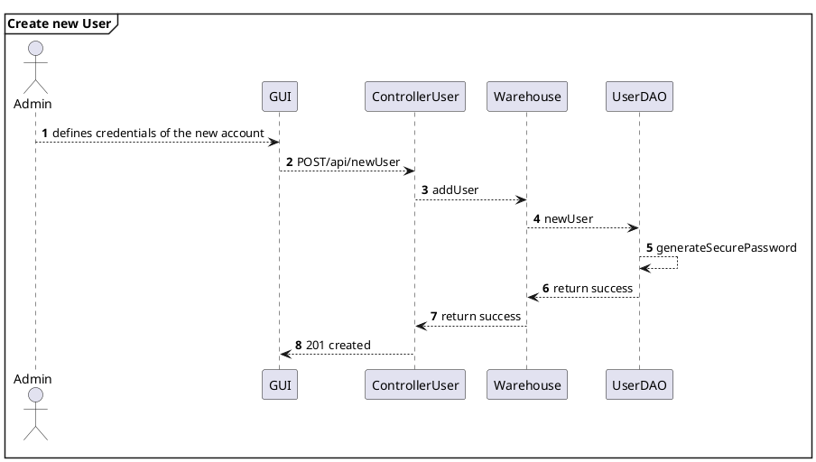
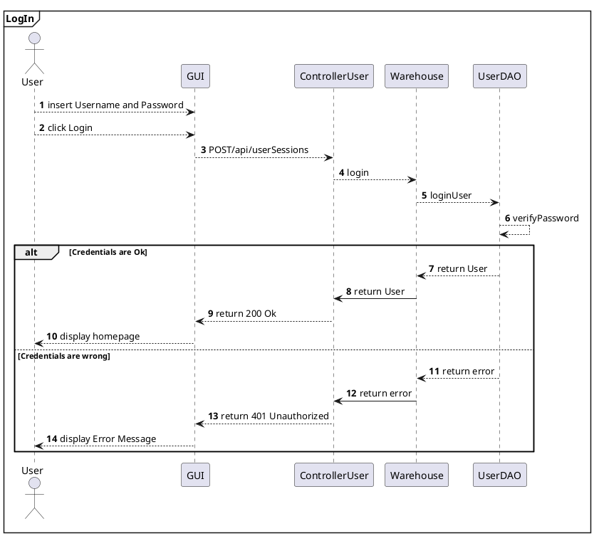

# Design Document 

Authors: 
Alessandro Zamparutti
Michele Pistan
Nicola di Gruttola Giardino
Nicolò Gallo

Date: 26 April 2022

Version: 2.0


# Contents

- [Design Document](#design-document)
- [Contents](#contents)
- [Instructions](#instructions)
- [High level design](#high-level-design)
- [Low level design](#low-level-design)
- [Verification traceability matrix](#verification-traceability-matrix)
- [Verification sequence diagrams](#verification-sequence-diagrams)
    - [Scenario 1.2](#scenario-12)
    - [Scenario 3.2](#scenario-32)
    - [Scenario 4.1](#scenario-41)
    - [Scenario 7.1](#scenario-71)
  

# Instructions

The design must satisfy the Official Requirements document 

# High level design 

The EZWH application follows the architectural pattern Model-View-Control. The View package contains the GUI, and it is given: so it is not descripted in this document. The class Warehouse is a facade for the classes in the Model package. We also used the Adapter Pattern: each Controller class is associated with a single API, it receives data from header and body of the HTTP request and transforms them in the format requested by the Warehouse class.

```plantuml
top to bottom direction

package "View" #DDDDDD {

}

'End of View

package "Controller" #DDDDDD {

}

'End of Controller

package "Model" #DDDDDD {

}

```

# Low level design


```plantuml
top to bottom direction

package "View" #DDDDDD {

class GUI

note " The Graphical User Interface is fixed\n and not designed in this Document " as N1  
N1 .. GUI
}

'End of View

```

```plantuml
package "Controller" #DDDDDD {

  class controllerSKU{
    router : Router
    warehouse : Warehouse
    post('/sku') : HTTPresponse
    get('/skus') : HTTPresponse
    get('/skus/:id') : HTTPresponse
    put('/sku/:id') : HTTPresponse
    put('/sku/:id/position') : HTTPresponse
    delete('/skus/:id') : HTTPresponse
  }

  class controllerSKUItem {
    router : Router
    warehouse : Warehouse
    post('/skuitem') : HTTPresponse
    get('/skuitems') : HTTPresponse
    get('/skuitems/sku/:id) : HTTPresponse
    get('/skuitems/:rfid') : HTTPresponse
    put('/skuitems/:rfid') : HTTPresponse
    delete('/skuitems/:rfid') : HTTPresponse
  }

  class ControllerPosition{
    router : Router
    warehouse : Warehouse
    post('/position') : HTTPresponse
    get('/positions') : HTTPresponse
    put('/position/:positionID') : HTTPresponse
    put('/position/:positionID/changeID') : HTTPresponse
    delete('/position/:positionID') : HTTPresponse
  }

  class controllerTestDescriptor {
    router : Router
    warehouse : Warehouse
    get('/testDescriptors') : HTTPresponse
    get('/testDescriptors/:id') : HTTPresponse
    post('/testDescriptor') : HTTPresponse
    put('/testDescriptor/:id') : HTTPresponse
    delete('/testDescriptor/:id') : HTTPresponse
  }

  class controllerTestResult {
    router : Router
    warehouse : Warehouse
    get('/skuitems/:rfid/testResults') : HTTPresponse
    get('/skuitems/:rfid/testResults/:id') : HTTPresponse
    post('/skuitems/testResult') : HTTPresponse
    put('/skuitems/:rfid/testResult/:id') : HTTPresponse
    delete('/skuitems/:rfid/testResult/:id') : HTTPresponse
  }

  class controllerUser {
    router : Router
    warehouse : Warehouse
    post('/newUser') : HTTPresponse
    get('/userinfo') : HTTPresponse
    get('/suppliers') : HTTPresponse
    get('/users') : HTTPresponse
    post('/managerSessions') : HTTPresponse
    post('/customerSessions') : HTTPresponse
    post('/supplierSessions') : HTTPresponse
    post('/clerkSessions') : HTTPresponse
    post('/qualityEmployeeSessions') : HTTPresponse
    post('/deliveryEmployeeSessions') : HTTPresponse
    put('/users/:username') : HTTPresponse
    delete('/users/:username/:type') : HTTPresponse
  }

  class controllerRestockOrder{
    router : Router
    warehouse : Warehouse
    post('/restockOrder') : HTTPresponse
    get('/restockOrders') : HTTPresponse
    get('/restockOrdersIssued') : HTTPresponse
    get('/restockOrders/:id') : HTTPresponse
    get('/restockOrders/:id/returnItems') : HTTPresponse
    put('/restockOrder/:id') : HTTPresponse
    put('/restockOrder/:id/skuItems') : HTTPresponse
    put('/restockOrder/:id/transportNote') : HTTPresponse
    delete('/restockOrder/:id') : HTTPresponse
  }

  class controllerReturnOrder{
    router : Router
    warehouse : Warehouse
    get('/returnOrders') : HTTPresponse
    get('/returnOrders/:id') : HTTPresponse
    post('/returnOrder') : HTTPresponse
    delete('/returnOrder/:id') : HTTPresponse
  }

  class controllerInternalOrder{
    router : Router
    warehouse : Warehouse
    get('/internalOrders') : HTTPresponse
    get('/internalOrdersIssued') : HTTPresponse
    get('/internalOrdersAccepted') : HTTPresponse
    get('/internalOrders/:id') : HTTPresponse
    post('/internalOrders') : HTTPresponse
    put('/internalOrders/:id') : HTTPresponse
    delete('/internalOrders/:id') : HTTPresponse
  }

  class controllerItem {
    router : Router
    warehouse : Warehouse
    get('/items') : HTTPresponse
    get('/items/:id') : HTTPresponse
    post('/item') : HTTPresponse
    put('/item/:id') : HTTPresponse
    delete('/items/:id') : HTTPresponse
  }
  
}
'End of Controller
```

```plantuml

package "Model" #DDDDDD {

  class Warehouse{
    userDAO : UserDAO
    skuDAO : SkuDAO
    skuItemDAO : SKUItemDAO
    positionDAO : PositionDAO
    restockOrderDAO : RestockOrderDAO
    returnOrderDAO : ReturnOrderDAO
    internalOrderDAO : InternalOrderDAO
    itemDAO : ItemDAO
    testDescriptorDAO : TestDescriptorDAO
    testResultDAO : TestResultDAO
    
    addSKU(description, weight, volume, notes, price, availableQty) : Integer //lastID
    getSKUs() : SKU [ ]
    getSKU(skuID) : SKU
    modifySKU(skuID, description, weight, volume, notes, price, availableQty) : Integer //# modifications
    modifySKUposition(skuID, positionID) : Integer //# modifications
    deleteSKU(skuID) : Integer //# modifications

    addSKUItem(rfid, skuID, dateOfStock) : Integer //lastID
    getSKUItem(rfid) : SKUItem
    getSKUitems() : SKUItem [ ]
    getSKUitemsBySKUid(skuID) : SKUItem [ ]
    modifySKUItem(rfid, newRFID, newAvailable, newDate) : Integer //# modifications
    deleteSKUItem(rfid) : Integer //# modifications

    addPosition(positionID, aisle, row, col, maxWeight, maxVolume) : Integer //lastID
    getPositions() : Position [ ]
    modifyPosition(positionID, aisle, row, col, maxWeight, maxVolume, occupiedWeight, occupiedVolume) : Integer //# modifications
    modifyPositionID(oldPositionID, newPositionID) : Integer //# modifications
    deletePosition(positionID) : Integer //# modifications
    
    addRestockOrder(products, supplierID, issueDate) : Integer //lastID
    getRestockOrder(restockOrderID) : RestockOrder
    getRestockOrders() : RestockOrder [ ]
    getRestockOrdersIssued() : RestockOrder [ ]
    restockOrderAddSKUItems(restockOrderID, SKUItemIdList) : Integer //# modifications
    restockOrderAddTransportNote(restockOrderID, Date) : Integer //# modifications
    modifyRestockOrderState(restockOrderID, newState) : Integer //# modifications
    returnItemsFromRestockOrder(restockOrderID) : SKUItem[ ]
    deleteRestockOrder(restockOrderID) : Integer //# modifications

    addReturnOrder(SKUItemList, restockOrderId, returnDate) : Integer //lastID
    getReturnOrders() : ReturnOrder [ ]
    getReturnOrderById(ID) : ReturnOrder
    deleteReturnOrder(ID) : Integer //# modifications
    sendNotificationRO(userID, returnOrderID) : void

    addInternalOrder(products, customerID, issueDate) : Integer //lastID
    getInternalOrders() : InternalOrder [ ]
    getInternalOrdersIssued() : InternalOrder [ ]
    getAcceptedInternalOrders() : InternalOrder[ ]
    getInternalOrder(ID) : InternalOrder
    setIOStatus(ID, status, products) : bool
    deleteInternalOrder(ID) : Integer //# modifications

    addUser(username, name, surname, password, type) : Integer //lastID
    getUsers() : User [ ]
    getSuppliers() : User [ ]
    login(username, password, type) : User
    modifyUserRights(username, oldType, newType) : Integer //# modifications
    deleteUser(username, type) : Integer //# modifications

    getItems() : Item [ ]
    getItem(id) : Item
    addItem(id, description, price, SKUId, supplierId) : Integer //lastID
    modifyItem(ID, newDescription, newPrice) : Integer //# modifications
    deleteItem(id) : Integer //# modifications

    getTestDescriptors() : TestDescriptor [ ]
    getTestDescriptor(ID) : TestDescriptor
    addTestDescriptor(name, procedureDescription, idSKU) : Integer //lastID 
    modifyTestDescriptor(id, newName, newProcedureDescription, newIdSKU) : Integer //# modifications
    deleteTestDescriptor(id) : Integer //# modifications

    getTestResults() : TestResult [ ]
    getTestResult(rfid, id) : TestResult
    addTestResult(rfid, idTestDescriptor, date, result) : Integer //lastID
    modifyTestResult(rfid, id, newIdTestDescriptor, newDate, newResult) : void
    deleteTestResult(ID) : Integer //# modifications      
  }

  class SKU {
    id : int
    description : string
    weight : float
    volume : float
    notes : string
    position : PositionID
    availableQuantity : int
    price : double
    testDescriptors : TestDescriptor [ ]

    constructor(id, description, weight, volume, notes, price, availableQuantity, positionID) : SKU
    getID( ) : int
    getDescription( ) : string
    getWeight( ) : float
    getVolume( ) : float
    getNotes( ) : string
    getAvailableQuantity( ) : int
    getPrice( ) : double
    getPosition( ) : PositionID
    getTestDescriptors() : TestDescriptor [ ]
    setDescription(description) : void
    setWeight(weight) : void
    setVolume(volume) : void
    setNotes(notes) : void
    setPosition(positionID) : void
    setAvailableQuantity(availableQty) : void
    setPrice(price) : void
    addTestDescriptor(testDescriptor) : void
    convertToObj( ) : Obj
  }

  class SKUItem {
    RFID : string
    available : boolean
    sku : SKU
    DateOfStock : DateTime
    restockOrder : RestockOrder
    testResults : TestResult [ ]

    constructor(RFID, sku, available, dateOfStock, restockOrder) : SKUItem
    getRFID( ) : string
    getSKU( ) : SKU
    getAvailable( ) : boolean
    getDateOfStock( ) : DateTime
    setRFID(rfid) ; void
    setAvailable(available) : void
    setDateOfStock(date) : void
    setRestockOrder(restockOrder) : void
    setSKU(sku) : void
    isAvailable( ) : boolean
    addTestResult(testResult) : void
    convertToObj( ) : Obj
    convertToObjSimple( ) : Obj
  }

  class Position {
    positionID : string
    aisle : string
    row : string
    col : string
    maxWeight : float
    maxVolume : float
    occupiedWeight : float
    occupiedVolume : float
    assignedSKU : SKU
    
    constructor(positionID, aisle, row, col, maxWeight, maxVolume, occupiedWeight, occupiedVolume, assignedSKU) : Position
    getPositionID( ) : string
    getAisle( ) : string
    getRow( ) : string
    getCol( ) : string
    getMaxWeight( ) : float
    getMaxVolume( ) : float
    geOccupiedtWeight( ) : float
    getOccupiedVolume( ) : float
    getAssignedSKU( ) : SKU
    setAssignedSKU(sku) : void
    convertToObj( ) : Obj
  }

  class TestDescriptor {
    id : string
    name : string
    procedureDescription : string
    SKUid : int

    constructor(id, name, procedureDescription, SKUid) : TestDescriptor
    getID( ) : string
    getName( ) : string
    getProcedureDescription( ) : string
    getSKUid( ) : int
    setID(ID) : void
    setName(name) : void
    setProcedureDescription(description) : void
    setSKUid(SKUid) : void
    modifyTestDescriptorData(newName, newProcedureDescription, newIdSKU, TestDescriptorDAO) : Integer
    convertToObj( ) : Obj
  }

  class TestResult {
    id : int
    rfid : string
    idTestDescriptor : string
    date : DateTime
    result : boolean

    constructor(id, rfid, idTestDescriptor, date, result) : TestResult
    getID( ) : int
    getRFID( ) : string
    getIdTestDescriptor( ) : string
    getDate( ) : Date
    getResult( ) : bool
    setRFID(RFID) : void
    setIdTestDescriptor(idTestDescriptor) : void
    setDate(date) : void
    setResult(result) : void
    modifyTestResultData(newIdTestDescriptor, newDate, newResult, TestResultDAO) : Integer
    convertToObj( ) : Obj
  }

  class User {
    userID : int
    name : string
    surname : string
    email : string
    type : string
    type [Manager, Admin, Supplier, Clerk, QualityCheckEmployee, DeliveryEmployee, InternalCustomer]

    constructor(userID, name, surname, email, type) : User
    getUserID( ) : int
    getName( ) : string
    getSurname( ) : string
    getEmail( ) : string
    getType( ) : string
    setType(newType) : void
    convertToObj( ) : Obj
  }

  class RestockOrder {
    id : int
    issueDate : DateTime
    products : Product [ ]
    supplier : User
    transportNote : TransportNote
    SKUitems : SKUItem [ ]
    state : string
    state [ISSUED - DELIVERY - DELIVERED - TESTED - COMPLETEDRETURN - COMPLETED]
    
    constructor(id, issueDate, supplier, state. transportNote) : RestockOrder
    getID( ) : int
    getIssueDate( ) : DateTime
    getProducts( ) : Map <Item, int>
    getState( ) : string
    getTransportNote( ) : TransportNote
    getSKUitems( ) : SKUItem [ ]
    getSupplier( ) : User
    setSKUItems(skuItems) : void
    addProduct(item, description, price, qty) : void
    addSKUItems(skuItems) : void
    setState(newState) : void
    getSKUItemsFailedTest() : SKUItem[]
    convertToObj( ) : Obj
  }

  class TransportNote {
    dateDelivery : DateTime

    constructor(date) : TransportNote
    getShipmentDate( ) : DateTime
    convertToObj( ) : Obj
  }

  class ReturnOrder {
    id : int
    returnDate : DateTime
    restockOrderId : int
    products : SKUItem [ ]

    constructor(id, restockOrder, returnDate, products) : ReturnOrder
    getId( ) : int
    getReturnDate( ) : DateTime
    getProducts( ) : SKUItem [ ]
    getRestockOrderId( ) : int
    convertToObj( ) : Obj
  }

  class InternalOrder {
    id : int
    issueDate : DateTime
    products : Obj [ ]   
    internalCustomer : User
    state : string
    state [ISSUED - ACCEPTED - REFUSED - CANCELED - COMPLETED]

    constructor(id, customer, issueDate, state) : InternalOrder
    getId( ) : int
    getIssueDate( ) : DateTime
    getProducts( ) : Obj [ ]
    getState( ) : string
    addSKU(SKU, qty) : bool
    addProduct(skuId, price, description, qty, rfid) : void
    convertToObj( ) : Obj
  }

  class Item {
    id : int
    description : string
    price : double
    associatedSKU : SKU
    supplier : User

    constructor(id, description, price, associatedSKU, supplier) : Item
    getID( ) : int
    getDescription( ) : string
    getPrice( ) : double
    getAssociatedSKU( ) : SKU
    getSupplier( ) : User
    setDescription(description) : void
    setPrice(price) : void
    setAssociatedSKU(SKU) : void
    setSupplier(supplier) : void
    modifyItemData(newDescription, newPrice, ItemDAO) : Integer
    convertToObj( ) : Obj
  }  
}
Warehouse --> "*" SKU
Warehouse --> "*" SKUItem
Warehouse --> "*" TestDescriptor
Warehouse --> "*" TestResult
Warehouse --> "*" User
Warehouse --> "*" RestockOrder
Warehouse --> "*" ReturnOrder
Warehouse --> "*" InternalOrder
Warehouse --> "*" Item
Warehouse --> "*" Position
RestockOrder --> "*" Item
RestockOrder --> "0..1" TransportNote
RestockOrder --> "0..1" ReturnOrder : refers
RestockOrder --> "*" SKUItem
SKUItem "*" --> "0..1" ReturnOrder
SKU -- "*" SKUItem
SKU -- "*" Item : corresponds to 
SKU "*" -- "*" TestDescriptor
TestDescriptor -- "*" TestResult
SKU "1" -- "1" Position: must be placed in
InternalOrder -- "*" SKU
InternalOrder "0..1" -- "*" SKUItem
SKUItem -- "*" TestResult
SKUItem "*" -- "0..1" Position

'End of Model
```
```plantuml

package "Database" #DDDDDD {

  class UserDAO {
    constructor( ) : UserDAO
    newUser(username, name, surname, password, type) : Integer //lastID
    getAllUsers( ) : User [ ]
    getAllUsersByType(type) : User [ ]
    getUser(username, type) : User
    updateUser(username, oldType, newType) : Integer //# modifications
    loginUser(username, password, type) : User
    deleteUser = async (username, type) : Integer //# modifications
    generateSecurePassword(password)
    verifyPassword(passwordStored, saltStored, password)
  }
  
  class SkuDAO{
    constructor( ) : SkuDAO
    newSKU(description, weight, volume, notes, price, availableQty, position) : Integer
    getAllSKU( ) : SKU [ ]
    getSKU(skuID) : SKU
    updateSKU(skuID, newDescription, newWeight, newVolume, newNotes, newPrice, newAvailableQuantity, newPositionID) : Integer
    deleteSKU(skuID) : Integer
  }

  class SKUItemDAO{
    constructor( ) : SKUItemDAO
    newSKUItem(RFID, sku, available, dateOfStock, restockOrder=null) : Integer
    getSKUItem(rfid) : SKUItem
    getAllSKUItems( ) : SKUItem [ ]
    updateSKUItem(oldRFID, newRFID, newAvailable, newDate, restockOrderID) : Integer
    deleteSKUItem(rfid)
  }

  class PositionDAO{
    constructor( ) : PositionDAO
    newPosition(positionID, aisle, row, col, maxWeight, maxVolume, occupiedWeight, occupiedVolume, assignedSKUid) : Integer
    getAllPosition( ) : Position [ ]
    getPosition(positionID) : Position
    updatePosition(oldPositionID, newPositionID, aisle, row, col, maxWeight, maxVolume, occupiedWeight, occupiedVolume, skuID) : Integer
    deletePosition(positionID) : Integer
  }

  class RestockOrderDAO{
    constructor( ) : RestockOrderDAO
    newRestockOrder(products, state, supplierID, issueDate, transportNote) : Integer
    getRestockOrder(restockOrderID) : RestockOrder
    getAllRestockOrders( ) : RestockOrder [ ]
    updateRestockOrder(restockOrderID, newState, transportNote) : Integer
    deleteRestockOrder(restockOrderID) : Integer
  }

  class ReturnOrderDAO{
    constructor( ) : ReturnOrderDAO
    newReturnOrder(products, restockOrderId, returnDate) : Integer
    getReturnOrderById(returnOrderID) : ReturnOrder
    getAllReturnOrders( ) : ReturnOrder [ ]
    deleteReturnOrder(returnOrderID) : Integer
  }

  class InternalOrderDAO{
    constructor( ) : InternalOrderDAO
    newInternalOrder(issueDate, products, customerId, state) : Integer
    getAllInternalOrders( ) : InternalOrder [ ]
    getAllIssued( ) : InternalOrder [ ]
    getAllAccepted( ) : InternalOrder [ ]
    getInternalOrder(ID) : InternalOrder
    addDeliveredProducts(ID, SKUItemList) : void
    setStatus(ID, newState) : Integer
    deleteInternalOrder(ID) : Integer
  }

  class ItemDAO{
    constructor( ) : ItemDAO
    getAllItem( ) : Item [ ]
    getItem(id) : Item
    newItem(id, description, price, SKUId, supplierId) : Integer
    updateItem(id, newDescription, newPrice, associatedSKU, supplier) : Integer
    deleteItem(id) : Integer
  }

  class TestDescriptorDAO{
    constructor( ) : TestDescriptorDAO
    getAllTestDescriptor( ) : TestDescriptor[ ]
    getTestDescriptor(id) : TestDescriptor
    newTestDescriptor(name, procedureDescription, idSKU) : Integer
    updateTestDescriptor(id, newName, newProcedureDescription, newIdSKU) : Integer
    deleteTestDescriptor(id) : Integer
  }

  class TestResultDAO{
    constructor( ) : TestResultDAO
    getAllTestResult(rfid) : TestResult [ ]
    getTestResult(rfid, id) : TestResult
    newTestResult(rfid, idTestDescriptor, date, result) : Integer
    updateTestResult(id, rfid, newIdTestDescriptor, newDate, newResult) : Integer
    deleteTestResult(id, rfid) : Integer
  }

  class ConnectionDB{
    constructor( ) : ConnectionDB
    DBget(query, params) : Promise
    DBgetAll(query, params) : Promise
    DBexecuteQuery(query, params) : Promise
  }

  ConnectionDB <-- UserDAO
  ConnectionDB <-- SkuDAO
  ConnectionDB <-- SKUItemDAO
  ConnectionDB <-- PositionDAO
  ConnectionDB <-- RestockOrderDAO
  ConnectionDB <-- ReturnOrderDAO
  ConnectionDB <-- InternalOrderDAO
  ConnectionDB <-- ItemDAO
  ConnectionDB <-- TestDescriptorDAO
  ConnectionDB <-- TestResultDAO

}

'End of Database
```


# Verification traceability matrix

For each functional requirement from the requirement document, this table shows which classes concur to implement it.

| FR / Class |  ControllerSKU | ControllerSKUItem | ControllerPosition | ControllerTestDescriptor | ControllerTestResult | ControllerUser | ControllerRestockOrder | ControllerReturnOrder | ControllerInternalOrder | ControllerItem | Warehouse | SkuDAO | SKUItemDAO | PositionDAO | TestDescriptorDAO | TestResultDAO | UserDAO | RestockOrderDAO | ReturnOrderDAO | InternalOrderDAO | ItemDAO |
| :--------- | :---: | :---: | :---: | :---: | :---: | :---: | :---: | :---: | :---: | :---: | :---: | :---: | :---: | :---: | :---: | :---: | :---: | :---: | :---: | :---: | :---: |
| FR1 | | | | | | X | | | | | X | | | | | | X | | | | |
| FR2 | X | | | | | | | | | | X | X | | | | | | | | | |
| FR3.1 | | | X | | | | | | | | X | | | X | | | | | | | |
| FR3.2 | | | | X | X | | | | | | X | | | | X | X | | | | | |
| FR4 | | | | | | X | | | | | X | | | | | | X | | | | |
| FR5 | | X | | | | | X | X | | | X | | X | | | | | X | X | | |
| FR6 | | | | | | | | | X | | X | | X | | | | | | | X | |
| FR7 | | | | | | | | | | X | X | | | | | | | | | | X |


# Verification sequence diagrams

### Scenario 1.2
```plantuml
mainframe **Modify SKU location**
actor Manager
participant GUI
participant ControllerSKU
participant ControllerPosition
participant Warehouse
participant SkuDAO
participant PositionDAO

autonumber
Manager -> GUI : inserts SKU ID
GUI -> ControllerSKU :  GET/api/skus/:id
ControllerSKU -> Warehouse : getSKU
Warehouse --> SkuDAO : getSKU
Warehouse <-- SkuDAO : return SKU
ControllerSKU <-- Warehouse : return SKU
GUI <-- ControllerSKU : 200 ok

Manager -> GUI : show list of positions
GUI -> ControllerPosition : GET/api/positions
ControllerPosition -> Warehouse : getPositions
Warehouse --> PositionDAO : getAllPosition
Warehouse <-- PositionDAO : return Position list
ControllerPosition <-- Warehouse : return Position list
GUI <-- ControllerPosition : 200 ok

Manager --> GUI : selects SKU position
GUI --> ControllerSKU : PUT/api/sku/:id/position
ControllerSKU --> Warehouse : modifySKUposition
Warehouse --> SkuDAO : getSKU
Warehouse <-- SkuDAO : return SKU
Warehouse --> PositionDAO : getPosition
Warehouse <-- PositionDAO : return Position
Warehouse --> SkuDAO : updateSKU
Warehouse <-- SkuDAO : return success
Warehouse --> PositionDAO : updatePosition
Warehouse <-- PositionDAO : return success
ControllerSKU <-- Warehouse : return success
GUI <-- ControllerSKU : 200 ok

@enduml
```


### Scenario 3.2
```plantuml
mainframe **Restock Order of SKU S issued by supplier**
actor Manager
participant GUI
participant ControllerUser
participant ControllerItem
participant ControllerRestockOrder
participant Warehouse
participant RestockOrderDAO
participant ItemDAO
participant UserDAO

autonumber
Manager --> GUI :  show list of Supplier
GUI --> ControllerUser : GET/api/suppliers
ControllerUser --> Warehouse : getSuppliers
Warehouse --> UserDAO : getAllUsersByType
Warehouse <-- UserDAO : return supplier list
ControllerUser <-- Warehouse : return supplier list
GUI <-- ControllerUser : 200 ok

Manager --> GUI : select Items
GUI --> ControllerItem : GET/api/items
ControllerItem --> Warehouse : getItems
Warehouse --> ItemDAO : getAllItem
Warehouse <-- ItemDAO : return Item list
ControllerItem <-- Warehouse : return Item list
GUI <-- ControllerItem : return 200 ok

Manager --> GUI : select single Item
GUI -> ControllerItem : GET/api/items/:id
ControllerItem -> Warehouse : getItem
Warehouse --> ItemDAO : getItem
Warehouse <-- ItemDAO : return Item
ControllerItem <-- Warehouse : return Item
GUI <-- ControllerItem : return 200 ok

Manager -> GUI : inserts data
GUI -> ControllerRestockOrder : POST/api/restockOrder
ControllerRestockOrder -> Warehouse : addRestockOrder
Warehouse -> RestockOrderDAO : newRestockOrder
Warehouse <-- RestockOrderDAO : return success
ControllerRestockOrder <-- Warehouse : return success
GUI <-- ControllerRestockOrder : 201 Created

@enduml
```


### Scenario 4.1



### Scenario 7.1


