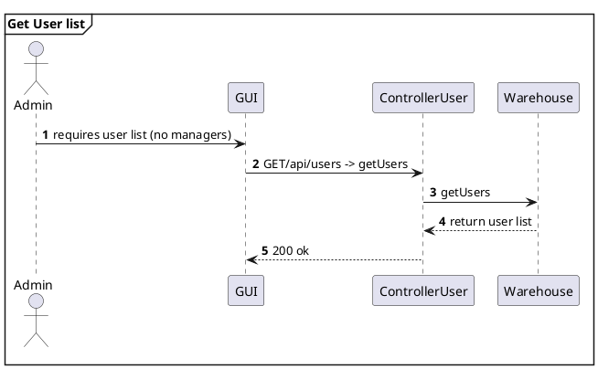
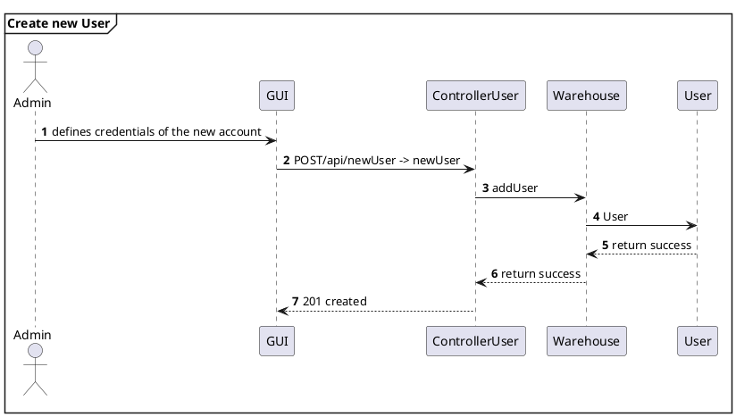
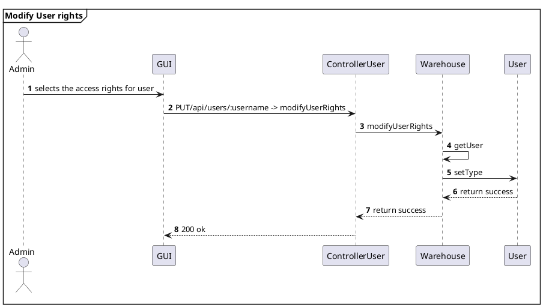
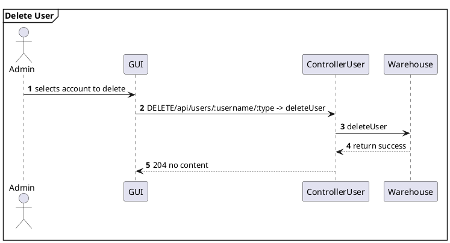
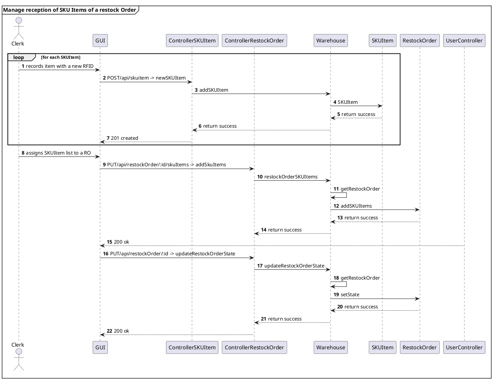
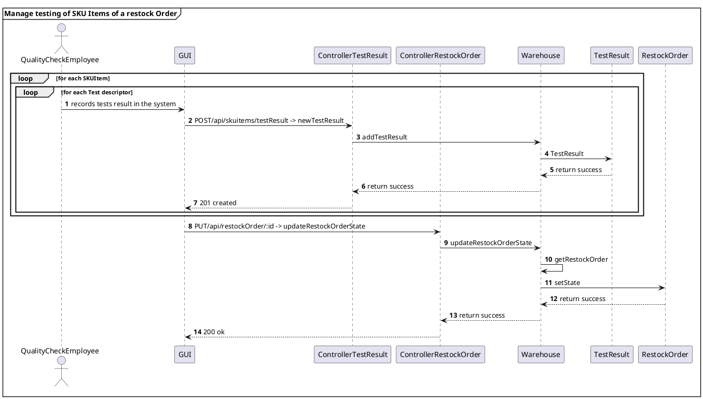
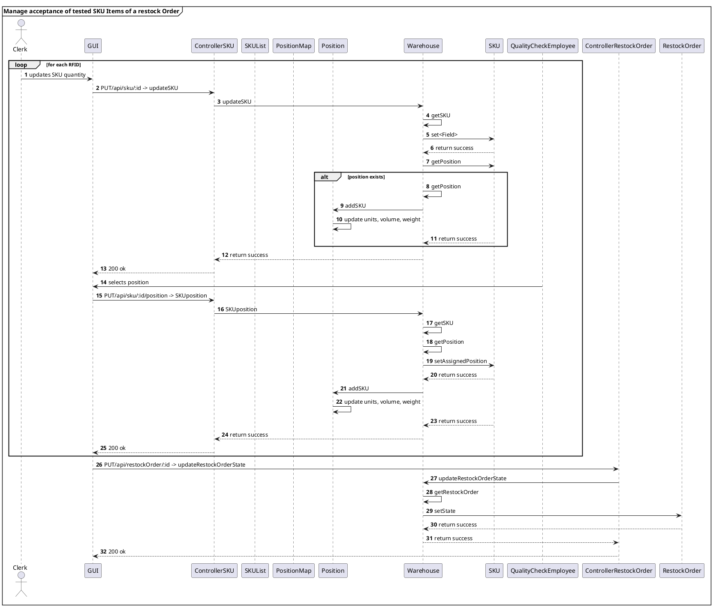
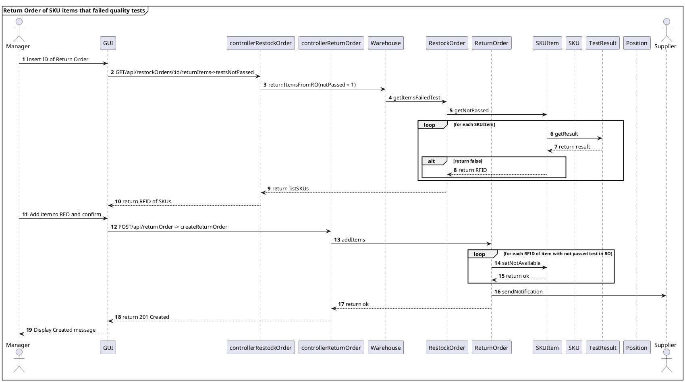

# Design Document 


Authors: 

Date:

Version:


# Contents

- [Design Document](#design-document)
- [Contents](#contents)
- [Instructions](#instructions)
- [High level design](#high-level-design)
- [Low level design](#low-level-design)
- [Verification traceability matrix](#verification-traceability-matrix)
- [Verification sequence diagrams](#verification-sequence-diagrams)
    - [Scenario 1.1](#scenario-11)
    - [Scenario 1.2](#scenario-12)
    - [Scenario 1.3](#scenario-13)
    - [Scenario 2.1](#scenario-21)
    - [Scenario 2.2](#scenario-22)
    - [Scenario 2.3](#scenario-23)
    - [Scenario 2.4](#scenario-24)
    - [Scenario 2.5](#scenario-25)
    - [Scenario 4.1](#scenario-41)
    - [Scenario 4.2](#scenario-42)
    - [Scenario 4.3](#scenario-43)
    - [Scenario 5.1.1](#scenario-511)
    - [Scenario 5.2.(1-2-3)](#scenario-521-2-3)
    - [Scenario 5.3.(1-3)](#scenario-531-3)
    - [Scenario 6.1](#scenario-61)
    - [Scenario 6.2](#scenario-62)
    - [Scenario 7.1](#scenario-71)
    - [Scenario 7.2](#scenario-72)
    - [Scenario 9.1](#scenario-91)
    - [Scenario 9.2](#scenario-92)
    - [Scenario 9.3](#scenario-93)
    - [Scenario 10.1](#scenario-101)
    - [Scenario 11.1](#scenario-111)
    - [Scenario 11.2](#scenario-112)
    - [Scenario 12.1](#scenario-121)
    - [Scenario 12.2](#scenario-122)
    - [Scenario 12.3](#scenario-123)

# Instructions

The design must satisfy the Official Requirements document 

# High level design 

```plantuml
top to bottom direction

package "View" #DDDDDD {

class GUI

note " The Graphical User Interface is fixed\n and not designed in this Document " as N1  
N1 .. GUI
}

'End of View

package "Controller" #DDDDDD {
class controllerSKU

class controllerSKUItem

class controllerPosition

class controllerTestDescriptor

class controllerTestResult

class controllerUser

class controllerRestockOrder

class controllerReturnOrder

class controllerInternalOrder

class controllerItem

}

'End of Controller


package "Model" #DDDDDD {

class Warehouse

class Supplier {
  ID
  name
}

note "Warehouse class is used as a Facade" as N4
N4 .. Warehouse

class Customer {
  ID
  name
  surname
}

class RestockOrder {
  ID
  issue date
  state [ISSUED - DELIVERY - DELIVERED - TESTED - COMPLETEDRETURN - COMPLETED]
}


class ReturnOrder {
  ID
  Return date
}

class InternalOrder {
  date
  from
  state [ISSUED - ACCEPTED - REFUSED - CANCELED - COMPLETED]
}

class Item {
  ID
  description
  price
}

class A {
  quantity
}


class TransportNote {
  Shipment date
}

class SKU {
  ID
  description
  weight
  volume
  price
  notes
}

class Inventory

class SKUItem {
  RFID
  Available [0 - 1]
}

class AA {
  quantity
}

class TestDescriptor {
  ID
  name
  procedure description
}

class AAA {
  date of stock 
}

class TestResult {
  ID
  date
  result boolean
}


class Position {
  positionID
  aisle 
  row
  col
  max weight
  max volume
  occupied weight
  occupied volume
}


}


controllerSKU -up- GUI
controllerSKUItem -up- GUI
controllerPosition -up- GUI
controllerUser -up- GUI
controllerUser -up- GUI
controllerReturnOrder -up- GUI
controllerItem -up- GUI
controllerTestDescriptor -up- GUI
controllerTestResult -up- GUI
controllerInternalOrder -up- GUI
controllerRestockOrder -up- GUI

controllerSKU -- Warehouse
controllerSKUItem -- Warehouse
controllerPosition -- Warehouse
controllerUser -- Warehouse
controllerUser -- Warehouse
controllerReturnOrder -- Warehouse
controllerItem -- Warehouse
controllerTestDescriptor -- Warehouse
controllerTestResult -- Warehouse
controllerInternalOrder -- Warehouse
controllerRestockOrder -- Warehouse

Warehouse -down- SKU
Warehouse -down- SKUItem
Warehouse -down- Position
Warehouse -down- Supplier
Warehouse -down- Customer
Warehouse -down- ReturnOrder
Warehouse -down- Item
Warehouse -down- TestDescriptor
Warehouse -down- TestResult
Warehouse -down- InternalOrder
Warehouse -down- RestockOrder


```

# Low level design

<for each package, report class diagram>

```plantuml
top to bottom direction

package "View" #DDDDDD {

class GUI

note " The Graphical User Interface is fixed\n and not designed in this Document " as N1  
N1 .. GUI
}

'End of Application Logic

package "Controller" #DDDDDD {

  class controllerSKU{
    modifySKUposition(SKU) : void
    modifySKUweight(SKU) : void
    modifySKUvolume(SKU) : void
  }

  class ControllerInventory{
    getSKUbyID(int) : SKU
  }

  class controllerSKUItem

  class ControllerPosition{
    newPosition(string) :  void
    modifyPositionID(Position, string) : void
    modifyAisleRowCol(Position, string, string, string) : void
    modifyPositionWeight(Position, float) : void
    modifyPositionVolume(position, float) : void
    deletePosition(Position) : void
  }

  class ControllerWarehouse{
    getFreePositons(SKU, int) : Position [ ]
    addNewPosition(Position) : void
    getAllPositions() : Position [ ]
    deletePositionFromWarehouse(Position) : void
  }

  class controllerTestDescriptor

  class controllerTestResult

  class controllerUser

  class controllerRestockOrder

  class controllerReturnOrder

  class controllerInternalOrder

  class controllerItem

}
'End of Presentation


package "Model" #DDDDDD {

  class Warehouse{
      PositionList : Position [ ]

      getPositions() : Position [ ]
      addPosition(Position) : void
      deletePosition(Position) : void
  }

  class Supplier {
    ID
    name
  }

  class Customer {
    ID
    name
    surname
  }

  class RestockOrder {
    ID
    issue date
    state [ISSUED - DELIVERY - DELIVERED - TESTED - COMPLETEDRETURN - COMPLETED]
  }


  class ReturnOrder {
    ID
    Return date
  }

  class InternalOrder {
    date
    from
    state [ISSUED - ACCEPTED - REFUSED - CANCELED - COMPLETED]
  }

  class Item {
    ID
    description
    price
  }

  class A {
    quantity
  }


  class TransportNote {
    Shipment date
  }

  class SKU {
    ID : string
    description : string
    weight : float
    volume : float
    price : float
    notes : string
    assignedPositions : Position [ ]

    getID() : int
    getWeight() : float
    getVolume() : float
    getAssignedPositions() : Position [ ]
    setDescription(string) : void
    setWeight(float) : void
    setVolume(float) : void
    setNotes(string) : void
    setAssignedPosition(Position) : void
    removeAssignedPosition(Position) : void
  }

  class Inventory{
      SKUlist : SKU [ ]

      getSKUlist() : SKU [ ]
  }

  class SKUItem {
    RFID : string
    Available [0 - 1]
    position : Position

    getRFID() : string
    getPosition() : Position
    setPosition(Position) : void
    removePosition() : void
  }

  class AA {
    quantity
  }

  class TestDescriptor {
    ID
    name
    procedure description
  }

  class AAA {
    date of stock 
  }

  class TestResult {
    ID
    date
    result boolean
  }


  class Position {
    positionID : int
    aisle : int
    row : int
    col : int
    max weight : float
    max volume : float
    occupied weight : float
    occupied volume : float
    assignedSKU : SKU
    storedSKUitems : SKUItem [ ]

    getAssignedSKU() : SKU
    getStoredSKUitems() : SKUItem [ ]
    getMaxWeight() : float
    getMaxVolume() : float
    setAisle(int) : void
    setRow(int) : void
    setCol(int) : void
    setPositionID(int) : void
    setMaxWeight(float) : void
    setMaxVolume(float) : void
    setAssignedSKU(SKU) : void
    setStoredSKUitem(SKUItem) : void
    hasAssignedSKU() : boolean
    canStoreSKUquantity(SKU, int) : boolean
    updatePositionIDFromAisleRowCol() : void
    updateAisleRowColFromPositionID() : void
    removeStoreSKUitem(SKUItem) : void
    removeAssignedSKU() : void
  }

}

Warehouse -- "*" Position
Supplier -- "*" Item : sells
Supplier -- "*" RestockOrder
RestockOrder -- "*" Item
RestockOrder -- "0..1" TransportNote
RestockOrder -- "0..1" ReturnOrder : refers
RestockOrder -- "*" SKUItem
SKUItem "*" -- "0..1" ReturnOrder
SKU -- "*" SKUItem
SKU -- "*" Item : corresponds to 
Inventory -- "*" SKU
SKU "*" -- "*" TestDescriptor
TestDescriptor -- "*" TestResult
SKU "1" -- "1" Position: must be placed in
InternalOrder -- "*" SKU
InternalOrder "0..1" -- "*" SKUItem
SKUItem -- "*" TestResult
SKUItem "*" -- "0..1" Position
Customer -- "*" InternalOrder : places

(RestockOrder, Item) .. A
(InternalOrder, SKU) .. AA
(SKUItem, Position) .. AAA


```


# Verification traceability matrix

\<for each functional requirement from the requirement document, list which classes concur to implement it>

| FR / Class |  SKU  | SKUItem | TestDescriptor | TestResult |  AAA  | Position | Warehouse | Inventory | Customer | InternalOrder |  AA   | Supplier | RestockOrder | TransportNote |   A   | Item  | ReturnOrder |
| :--------- | :---: | :-----: | :------------: | :--------: | :---: | :------: | :-------: | :-------: | :------: | :-----------: | :---: | :------: | :----------: | :-----------: | :---: | :---: | :---------: |
| FR1        |       |         |                |            |       |          |     X     |           |    X     |               |       |    X     |              |               |       |       |             |
| FR2        |   X   |    X    |                |            |   X   |    X     |           |     X     |          |               |       |          |              |               |       |       |             |
| FR3        |   X   |    X    |       X        |     X      |   X   |    X     |     X     |     X     |          |               |       |          |              |               |       |       |             |
| FR4        |       |         |                |            |       |          |           |           |    X     |               |       |          |              |               |       |       |             |
| FR5        |   X   |    X    |       X        |     X      |   X   |    X     |     X     |     X     |          |               |       |    X     |      X       |               |   X   |   X   |      X      |
| FR6        |   X   |    X    |                |            |   X   |    X     |     X     |     X     |    X     |       X       |   X   |          |              |               |       |       |             |
| FR7        |   X   |         |                |            |       |          |     X     |           |          |               |       |    X     |              |               |       |   X   |             |


# Verification sequence diagrams 
\<select key scenarios from the requirement document. For each of them define a sequence diagram showing that the scenario can be implemented by the classes and methods in the design

Alessandro -> 1 2 3
Michele -> 4 5
Nicola -> 6 7 9
Nicolò -> 10 11 12 >

### Scenario 1.1
```plantuml
mainframe **Create SKU**
actor Manager
participant GUI
participant ControllerSKU
participant Warehouse
participant SKU

autonumber
Manager -> GUI : inserts data
GUI -> ControllerSKU : POST/api/sku -> createSKU
ControllerSKU -> Warehouse : newSKU
Warehouse -> SKU : SKU
Warehouse <-> SKU : return success
ControllerSKU <-- Warehouse : return success
GUI <-- ControllerSKU : 201 created

@enduml
```

### Scenario 1.2
```plantuml
mainframe **Modify SKU location**
actor Manager
participant GUI
participant ControllerSKU
participant ControllerPosition
participant Warehouse
participant Inventory
participant SKU

autonumber
Manager -> GUI : inserts SKU ID
GUI -> ControllerSKU :  GET/api/skus/:id -> getSKUbyID
ControllerSKU -> Warehouse : getSKUbyID
Warehouse -> Inventory : getSKU
Warehouse <-- Inventory : return SKU
ControllerSKU <-- Warehouse : return SKU
GUI <-- ControllerSKU : 200 ok

Manager -> GUI : selects SKU record
GUI -> ControllerPosition : GET/api/positions -> getFreePositons
ControllerPosition -> Warehouse : getFreePositions
ControllerPosition <-- Warehouse : return Position list
GUI <-- ControllerPosition : 200 ok

Manager -> GUI : selects SKU position
GUI -> ControllerSKU : PUT/api/sku/:id/position -> SKUposition
ControllerSKU -> Warehouse : SKUposition
Warehouse -> Warehouse : getSKU
Warehouse -> Warehouse : getPosition
Warehouse -> SKU : setAssignedPosition
Warehouse <-- SKU : return success
Warehouse -> Position : addSKU
Position -> Position : update units, volume, weight
Warehouse <-- SKU : return success
ControllerSKU <-- Warehouse : return success
GUI <-- ControllerSKU : 200 ok

@enduml
```

### Scenario 1.3
```plantuml
mainframe **Modify SKU weight and volume**
actor Manager
participant GUI
participant ControllerSKU
participant Warehouse
participant Inventory
participant SKU

autonumber
Manager -> GUI : inserts SKU ID
GUI -> ControllerSKU :  GET/api/skus/:id -> getSKUbyID
ControllerSKU -> Warehouse : getSKUbyID
Warehouse -> Inventory : getSKU
Warehouse <-- Inventory : return SKU
ControllerSKU <-- Warehouse : return SKU
GUI <-- ControllerSKU : 200 ok

Manager -> GUI : inserts data
GUI -> ControllerSKU : PUT/api/sku/:id -> modifySKU
ControllerSKU -> Warehouse : modifySKU
Warehouse -> Inventory : getSKU
Warehouse <-- Inventory : return SKU
Warehouse -> SKU : setWeight
Warehouse <-- SKU : return success
Warehouse -> SKU : setVolume
Warehouse <-- SKU : return success
ControllerSKU <-- Warehouse : return success
GUI <-- ControllerSKU : 200 ok

@enduml
```

### Scenario 2.1
```plantuml
mainframe **Create Position**
actor Manager
participant GUI
participant ControllerPosition
participant Warehouse
participant Position

autonumber
Manager -> GUI : inserts data
GUI -> ControllerPosition : POST/api/position -> createPosition
ControllerPosition -> Warehouse : newPosition
Warehouse -> Position : Position
Warehouse <-- Position : return success
ControllerPosition <-- Warehouse : return success
GUI <-- ControllerPosition : 201 created

@enduml
```

### Scenario 2.2
```plantuml
mainframe **Modify positionID**
actor Manager
participant GUI
participant ControllerPosition
participant Warehouse
participant Position

autonumber
Manager -> GUI : show list of positions
GUI -> ControllerPosition : GET/api/positions -> getAllPositions
ControllerPosition -> Warehouse : getPositions
ControllerPosition <-- Warehouse : return Position list
GUI <-- ControllerPosition : 200 ok

Manager -> GUI : inserts new PositionID
GUI -> ControllerPosition : PUT/api/position/:positionID/changeID -> modifyPositionID
ControllerPosition -> Warehouse : modifyPositionID
Warehouse -> Warehouse : getPosition
Warehouse -> Position : setPositionID
Position -> Position : update Aisle Row Col
Warehouse <-- Position : return success
ControllerPosition <-- Warehouse : return success
GUI <-- ControllerPosition : 200 ok

@enduml
```

### Scenario 2.3
```plantuml
mainframe **Modify weight and volume of Position**
actor Manager
participant GUI
participant ControllerPosition
participant Warehouse
participant Position

autonumber
Manager -> GUI : selects position and inserts data
GUI -> ControllerPosition : PUT/api/position/:positionID-> modifyPosition
ControllerPosition -> Warehouse : modifyPositionWV
Warehouse -> Warehouse : getPosition
Warehouse -> Position : setMaxWeight
Warehouse <-- Position : return success
Warehouse -> Position : setMaxVolume
Warehouse <-- Position : return success
ControllerPosition <-- Warehouse : return success
GUI <-- ControllerPosition : 200 ok

@enduml
```

### Scenario 2.4
```plantuml
mainframe **Modify aisle ID, row and column of Position**
actor Manager
participant GUI
participant ControllerPosition
participant Warehouse
participant Position

autonumber
Manager -> GUI : inserts new Aisle Row Col
GUI -> ControllerPosition : PUT/api/position/:positionID -> modifyPosition
ControllerPosition -> Warehouse : modifyPositionAisleRowCol
Warehouse -> Warehouse : getPosition
Warehouse -> Position : setPositionAisleRowCol
Position -> Position : update positionID
Warehouse <-- Position : return success
ControllerPosition <-- Warehouse : return success
GUI <-- ControllerPosition : 200 ok

@enduml
```

### Scenario 2.5
```plantuml
mainframe **Delete Position**
actor Manager
participant GUI
participant ControllerPosition
participant Warehouse

autonumber
Manager -> GUI : delete positions selected
GUI -> ControllerPosition : DELETE/api/position/:positionID -> deletePositionFromWarehouse
ControllerPosition -> Warehouse : deletePosition
ControllerPosition <-- Warehouse : return success
GUI <-- ControllerPosition : 204 No Content

@enduml
```

### Scenario 3.1
```plantuml
mainframe **Restock Order of SKU S issued by quantity**
actor Manager
participant GUI
participant ControllerUser
participant ControllerRestockOrder
participant Warehouse
participant RestockOrder

autonumber
Manager -> GUI : inserts data
GUI -> ControllerUser : ??????
ControllerUser -> Warehouse : getSupplierThatCanSupplySKUquantity
Manager -> GUI : inserts data
GUI -> ControllerRestockOrder : POST/api/restockOrder -> createRestockOrder
ControllerRestockOrder -> Warehouse : newRestockOrder
Warehouse -> RestockOrder : RestockOrder
Warehouse <-- RestockOrder : return success
ControllerRestockOrder <-- Warehouse : return success
GUI <-- ControllerRestockOrder : 201 Created

@enduml
```

### Scenario 3.2
```plantuml
mainframe **Restock Order of SKU S issued by supplier**
actor Manager
participant GUI
participant ControllerUser
participant ControllerRestockOrder
participant Warehouse
participant RestockOrder

autonumber
Manager -> GUI :  show list of Supplier
GUI -> ControllerUser : GET/api/suppliers -> getAllSuppliers
ControllerUser -> Warehouse : getSuppliers
ControllerUser <-- Warehouse : return Supplier list
GUI <-- ControllerUser : 200 ok

Manager -> GUI : inserts data
GUI -> ControllerRestockOrder : POST/api/restockOrder -> createRestockOrder
ControllerRestockOrder -> Warehouse : newRestockOrder
Warehouse -> RestockOrder : RestockOrder
Warehouse <-- RestockOrder : return success
ControllerRestockOrder <-- Warehouse : return success
GUI <-- ControllerRestockOrder : 201 Created

@enduml
```

### Scenario 4.0


### Scenario 4.1


### Scenario 4.2


### Scenario 4.3

### Scenario 5.1.1


### Scenario 5.2.(1-2-3)


### Scenario 5.3.(1-3)


### Scenario 6.1


### Scenario 6.2
```plantuml
@startuml
mainframe **Return Order of any SKU items**
actor Manager 
participant GUI
participant controllerRestockOrder
participant controllerReturnOrder
participant Warehouse
participant RestockOrder
participant ReturnOrder
participant SKUItem
participant SKU
participant TestResult
participant Position
actor Supplier

autonumber
Manager -> GUI : insert ID of RestockOrder
GUI -> controllerRestockOrder : GET/api/restockOrders/:id/returnItems->All
controllerRestockOrder -> Warehouse : returnItemsFromRO(notPassed = 0)
Warehouse -> RestockOrder : getAllItemsToReturn
RestockOrder -> SKUItem : getNotPassed
loop for each SKUItem
  SKUItem -> TestResult : getResult
  SKUItem <-- TestResult : return result
  alt return false
    RestockOrder <-- SKUItem : return RFID
  else 
      SKUItem -> SKUItem : checkIfReturn
        alt return true
          RestockOrder <-- SKUItem : return RFID
        end alt
  end alt
end loop

RestockOrder --> controllerRestockOrder : return listSKUs
controllerRestockOrder --> GUI : return RFID of SKUs

Manager -> GUI : Add item to REO and confirm
GUI -> controllerReturnOrder : POST/api/returnOrder -> createReturnOrder
controllerReturnOrder -> ReturnOrder : addItems 
loop for each RFID of item with not passed test in RO
  ReturnOrder -> SKUItem : setNotAvailable
  SKUItem -> SKU : decreaseAvailableQty
  SKUItem <-- SKU : return ok
  SKUItem -> Position : increaseAvailablePos
  SKUItem <-- Position : return ok
  ReturnOrder <-- SKUItem : return ok
end loop
ReturnOrder -> Supplier : sendNotification
ReturnOrder --> controllerReturnOrder : return ok
controllerReturnOrder --> GUI : return 201 Created
GUI --> Manager : Display Created message
@enduml

```

### Scenario 7.1
```plantuml
@startuml
mainframe **LogIn**
actor User
participant GUI
participant controllerUser
participant Warehouse

autonumber
User -> GUI : insert Username and Password
User -> GUI : click Login
GUI -> controllerUser : POST/api/userSessions
controllerUser -> Warehouse : logIn
alt Credentials are Ok
  controllerUser <- Warehouse : return true
  GUI <-- controllerUser : return 200 Ok
  User <-- GUI : display homepage
else Credentials are wrong
  controllerUser <- Warehouse : return false
  GUI <-- controllerUser : return 401 Unauthorized
  User <-- GUI : display Error Message
end
@enduml
```

### Scenario 7.2
```plantuml
@startuml
mainframe **LogOut**
actor User
participant GUI
participant Warehouse
participant controllerUser

autonumber
User -> GUI : click on Logout
GUI -> controllerUser : POST/api/logout
controllerUser -> Warehouse : logOut
GUI <-- controllerUser : return 200 Ok
User <-- GUI : display Login page
@enduml
```

### Scenario 9.1
```plantuml
@startuml
mainframe **Internal Order accepted**
actor Customer
actor Manager
participant GUI
participant controllerInternalOrder
participant Warehouse
participant InternalOrder
participant SKU

autonumber
Customer -> GUI : start internal order and add SKUs
GUI -> controllerInternalOrder : POST/api/internalOrders
controllerInternalOrder -> Warehouse : createInternalOrder
loop for each SKU needed
  Warehouse -> InternalOrder : addSKU
  Warehouse <-- InternalOrder : return ok
  Warehouse -> InternalOrder : setQty
  Warehouse <-- InternalOrder : return ok
end loop
controllerInternalOrder <-- Warehouse : return ok
GUI <-- controllerInternalOrder : return 201 Created

Customer -> GUI : confirm IO
GUI -> controllerInternalOrder : PUT/api/internalOrders/:id->ISSUED
controllerInternalOrder -> Warehouse : setIOStatus(id,ISSUED)
Warehouse -> InternalOrder : setIssued
loop for each SKU in IO
  InternalOrder -> SKU : decreaseAvailableQty
  InternalOrder <-- SKU : return ok
  SKU -> Position : increaseAvailablePos
  SKU <-- Position : return ok
end loop
Warehouse <-- InternalOrder : return ok
controllerInternalOrder <-- Warehouse : return ok
GUI <-- controllerInternalOrder : return 200 OK

Manager -> GUI : check IO
GUI -> controllerInternalOrder : GET/api/internalOrdersIssued
controllerInternalOrder -> Warehouse : getOrdersIssued
controllerInternalOrder <-- Warehouse : return list issued
GUI <-- controllerInternalOrder : return 200 OK
Manager <-- GUI : display Issued orders

Manager -> GUI : confirm IO
GUI -> controllerInternalOrder : PUT/api/internalOrders/:id->ACCEPTED
controllerInternalOrder -> Warehouse : setIOStatus(id,ACCEPTED)
Warehouse -> InternalOrder : setAccepted
Warehouse <-- InternalOrder : return ok
controllerInternalOrder <-- Warehouse : return ok
GUI <-- controllerInternalOrder : return 200 OK
@enduml
```

### Scenario 9.2
```plantuml
@startuml
mainframe **Internal Order refused**
actor Customer
actor Manager
participant GUI
participant controllerInternalOrder
participant Warehouse
participant InternalOrder
participant SKU

autonumber
Customer -> GUI : start internal order and add SKUs
GUI -> controllerInternalOrder : POST/api/internalOrders
controllerInternalOrder -> Warehouse : createInternalOrder
loop for each SKU needed
  Warehouse -> InternalOrder : addSKU
  Warehouse <-- InternalOrder : return ok
  Warehouse -> InternalOrder : setQty
  Warehouse <-- InternalOrder : return ok
end loop
controllerInternalOrder <-- Warehouse : return ok
GUI <-- controllerInternalOrder : return 201 Created

Customer -> GUI : confirm IO
GUI -> controllerInternalOrder : PUT/api/internalOrders/:id->ISSUED
controllerInternalOrder -> Warehouse : setIOStatus(id,ISSUED)
Warehouse -> InternalOrder : setIssued
loop for each SKU in IO
  InternalOrder -> SKU : decreaseAvailableQty
  InternalOrder <-- SKU : return ok
  SKU -> Position : increaseAvailablePos
  SKU <-- Position : return ok
end loop
Warehouse <-- InternalOrder : return ok
controllerInternalOrder <-- Warehouse : return ok
GUI <-- controllerInternalOrder : return 200 OK

Manager -> GUI : check IO
GUI -> controllerInternalOrder : GET/api/internalOrdersIssued
controllerInternalOrder -> Warehouse : getOrdersIssued
controllerInternalOrder <-- Warehouse : return list issued
GUI <-- controllerInternalOrder : return 200 OK
Manager <-- GUI : display Issued orders

Manager -> GUI : refuse IO
GUI -> controllerInternalOrder : PUT/api/internalOrders/:id->REFUSED
controllerInternalOrder -> Warehouse : setIOStatus(id,REFUSED)
Warehouse -> InternalOrder : setRefused
Warehouse <-- InternalOrder : return ok
controllerInternalOrder <-- Warehouse : return ok
GUI <-- controllerInternalOrder : return 200 OK
@enduml
```

### Scenario 9.3
```plantuml
@startuml
mainframe **Internal Order cancelled**
actor Customer
participant GUI
participant controllerInternalOrder
participant Warehouse
participant InternalOrder
participant SKU

autonumber
Customer -> GUI : start internal order and add SKUs
GUI -> controllerInternalOrder : POST/api/internalOrders
controllerInternalOrder -> Warehouse : createInternalOrder
loop for each SKU needed
  Warehouse -> InternalOrder : addSKU
  Warehouse <-- InternalOrder : return ok
  Warehouse -> InternalOrder : setQty
  Warehouse <-- InternalOrder : return ok
end loop
controllerInternalOrder <-- Warehouse : return ok
GUI <-- controllerInternalOrder : return 201 Created

Customer -> GUI : confirm IO
GUI -> controllerInternalOrder : PUT/api/internalOrders/:id->ISSUED
controllerInternalOrder -> Warehouse : setIOStatus(id,ISSUED)
Warehouse -> InternalOrder : setIssued
loop for each SKU in IO
  InternalOrder -> SKU : decreaseAvailableQty
  InternalOrder <-- SKU : return ok
  SKU -> Position : increaseAvailablePos
  SKU <-- Position : return ok
end loop
Warehouse <-- InternalOrder : return ok
controllerInternalOrder <-- Warehouse : return ok
GUI <-- controllerInternalOrder : return 200 OK

Customer -> GUI : delete IO
GUI -> controllerInternalOrder : PUT/api/internalOrders/:id->CANCELLED
controllerInternalOrder -> Warehouse : setIOStatus(id,CANCELLED)
Warehouse -> InternalOrder : setIssued
loop for each SKU in IO
  InternalOrder -> SKU : increaseAvailableQty
  InternalOrder <-- SKU : return ok
  SKU -> Position : decreaseAvailablePos
  SKU <-- Position : return ok
end loop
Warehouse <-- InternalOrder : return ok
controllerInternalOrder <-- Warehouse : return ok
GUI <-- controllerInternalOrder : return 200 OK
@enduml
```

### Scenario 10.1
```plantuml
@startuml
mainframe **Internal Order completed**
actor DeliveryEmployee
participant GUI
participant controllerInternalOrder
participant InternalOrder
participant controllerSKUItem
participant SKUItem

autonumber
GUI -> controllerInternalOrder : GET/api/inernalOrdersAccepted
GUI <-- controllerInternalOrder : 200 OK
DeliveryEmployee -> GUI : select internal order
GUI -> controllerInternalOrder : GET/api/internalOrders/:id
GUI <-- controllerInternalOrder : 200 OK
loop for each SKUitem in products
  GUI -> controllerSKUItem : GET/api/skuitems/sku/:id
  controllerSKUItem -> SKUItem : setNotAvailable
  controllerSKUItem <-- SKUItem : ok
  GUI <-- controllerSKUItem : 200 OK (add to an array of rfid??)
end loop

GUI -> controllerInternalOrder : PUT/api/internalOrders/:id completed, array
GUI <-- controllerInternalOrder : 200 OK
@enduml
```

### Scenario 11.1
```plantuml
mainframe **Create Item**
actor Supplier
participant GUI
participant ControllerItem
participant Item

autonumber
Supplier -> GUI : insert description, SKUid, price 
GUI -> ControllerItem : POST/api/item
ControllerItem -> Item : newItem

alt id is available
  ControllerItem <-- Item : return success
  GUI <-- ControllerItem : 201 created
else id is already used
  ControllerItem <-- Item : return error
  GUI <-- ControllerItem : 422 Unprocessable Entity
  Supplier <-- GUI : display Error Message
end

Supplier -> GUI : confirm data
GUI -> ControllerItem : ??
GUI <-- ControllerItem : ??

@enduml
```

### Scenario 11.2
```plantuml
mainframe **Modify Item**
actor Supplier
participant GUI
participant ControllerItem
participant Item

autonumber
Supplier -> GUI : insert id, new price and new description
GUI -> ControllerItem : GET/api/items/:id
ControllerItem -> Item : modifyItem
ControllerItem <-- Item : return success
GUI <-- ControllerItem : 200 OK
Supplier -> GUI : confirm data
GUI -> ControllerItem : ??
GUI <-- ControllerItem : ??

@enduml
```

### Scenario 12.1
```plantuml
mainframe **Create Test Description**
actor Manager
participant GUI
participant ControllerTestDescriptor
participant TestDescriptor
participant ControllerSKU

autonumber
GUI -> ControllerSKU : GET/api/skus
GUI <-- ControllerSKU : 200 OK
Manager -> GUI : M selects SKU
Manager -> GUI : M defines name and procedure description
GUI -> ControllerTestDescriptor : POST/api/testDescriptor
ControllerTestDescriptor -> TestDescriptor : createTestDescriptor
ControllerTestDescriptor <-- TestDescriptor : return success
GUI <-- ControllerTestDescriptor : 201 Created
Manager -> GUI : confirm data
GUI -> ControllerTestDescriptor : ??
GUI <-- ControllerTestDescriptor : ??

@enduml
```

### Scenario 12.2
```plantuml
mainframe **Update Test Description**
actor Manager
participant GUI
participant ControllerTestDescriptor
participant TestDescriptor

autonumber
GUI -> ControllerTestDescriptor : GET/api/testDescriptors
GUI <-- ControllerTestDescriptor : 200 OK
Manager -> GUI : M selects T
Manager -> GUI : M update procedure description
GUI -> ControllerTestDescriptor : PUT/api/testDescriptor/:id
ControllerTestDescriptor -> TestDescriptor : modifyTestDescriptor
ControllerTestDescriptor <-- TestDescriptor : return success
GUI <-- ControllerTestDescriptor : 200 OK
Manager -> GUI : confirm data
GUI -> ControllerTestDescriptor : ??
GUI <-- ControllerTestDescriptor : ??

@enduml
```

### Scenario 12.3
```plantuml
mainframe **Delete Test Description**
actor Manager
participant GUI
participant ControllerTestDescriptor
participant TestDescriptor

autonumber
GUI -> ControllerTestDescriptor : GET/api/testDescriptors
GUI <-- ControllerTestDescriptor : 200 OK
Manager -> GUI : M selects T
GUI -> ControllerTestDescriptor : DELETE/api/testDescriptor/:id
ControllerTestDescriptor -> TestDescriptor : deleteTestDescriptor
ControllerTestDescriptor <-- TestDescriptor : return success
GUI <-- ControllerTestDescriptor : 204 No Content
Manager -> GUI : confirm deletion
GUI -> ControllerTestDescriptor : ??
GUI <-- ControllerTestDescriptor : ??

@enduml
```
