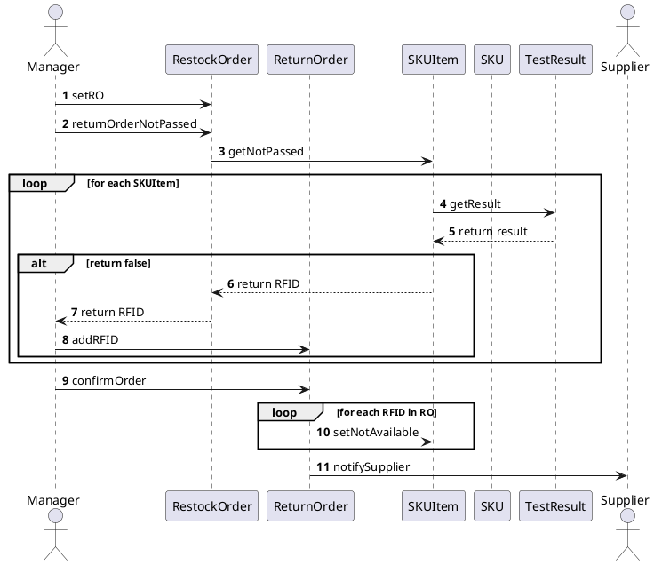
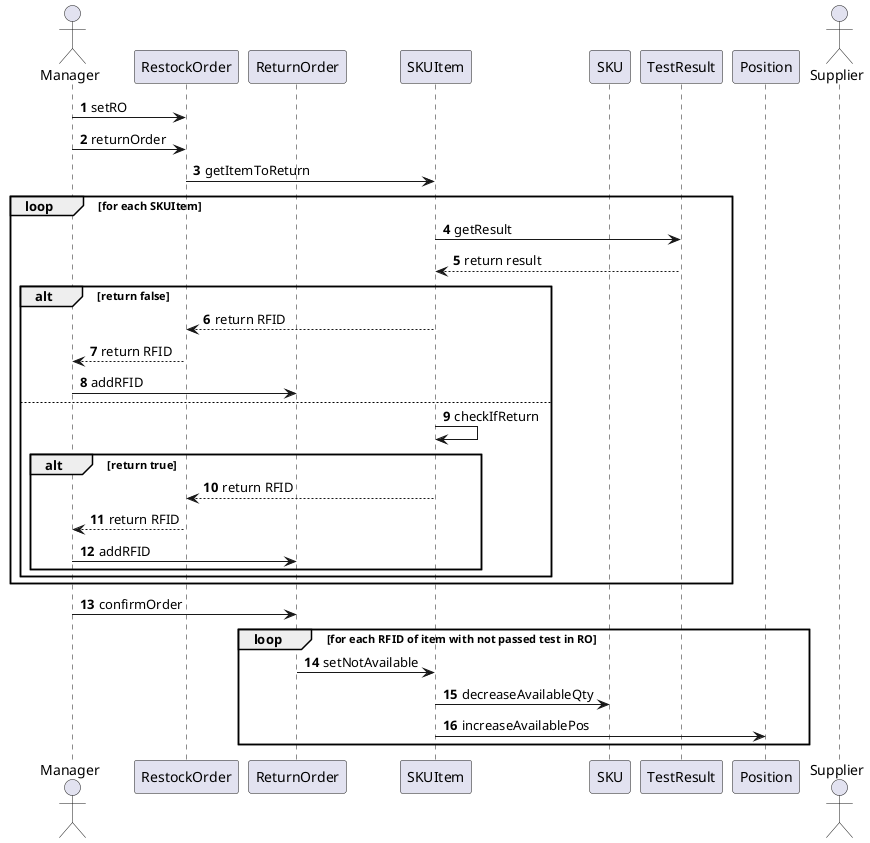
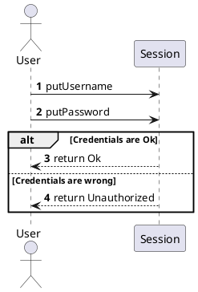
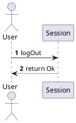

# Design Document 


Authors: 

Date:

Version:


# Contents

- [Design Document](#design-document)
- [Contents](#contents)
- [Instructions](#instructions)
- [High level design](#high-level-design)
- [Low level design](#low-level-design)
- [Verification traceability matrix](#verification-traceability-matrix)
- [Verification sequence diagrams](#verification-sequence-diagrams)
    - [Scenario 6.1](#scenario-61)
    - [Scenario 6.2](#scenario-62)
    - [Scenario 7.1](#scenario-71)
    - [Scenario 7.2](#scenario-72)

# Instructions

The design must satisfy the Official Requirements document 

# High level design 

```plantuml
top to bottom direction

package "View" #DDDDDD {

class GUI

note " The Graphical User Interface is fixed\n and not designed in this Document " as N1  
N1 .. GUI
}

'End of View

package "Controller" #DDDDDD {
class controllerSKU

class controllerSKUItem

class controllerPosition

class controllerTestDescriptor

class controllerTestResult

class controllerUser

class controllerRestockOrder

class controllerReturnOrder

class controllerInternalOrder

class controllerItem

}

'End of Controller


package "Model" #DDDDDD {

class Warehouse

class Supplier {
  ID
  name
}

class Customer {
  ID
  name
  surname
}

class RestockOrder {
  ID
  issue date
  state [ISSUED - DELIVERY - DELIVERED - TESTED - COMPLETEDRETURN - COMPLETED]
}


class ReturnOrder {
  ID
  Return date
}

class InternalOrder {
  date
  from
  state [ISSUED - ACCEPTED - REFUSED - CANCELED - COMPLETED]
}

class Item {
  ID
  description
  price
}

class A {
  quantity
}


class TransportNote {
  Shipment date
}

class SKU {
  ID
  description
  weight
  volume
  price
  notes
}

class Inventory

class SKUItem {
  RFID
  Available [0 - 1]
}

class AA {
  quantity
}

class TestDescriptor {
  ID
  name
  procedure description
}

class AAA {
  date of stock 
}

class TestResult {
  ID
  date
  result boolean
}


class Position {
  positionID
  aisle 
  row
  col
  max weight
  max volume
  occupied weight
  occupied volume
}

}

```

# Low level design

<for each package, report class diagram>

```plantuml
top to bottom direction

package "View" #DDDDDD {

class GUI

note " The Graphical User Interface is fixed\n and not designed in this Document " as N1  
N1 .. GUI
}

'End of Application Logic

package "Controller" #DDDDDD {
class controllerSKU

class controllerSKUItem

class controllerPosition

class controllerTestDescriptor

class controllerTestResult

class controllerUser

class controllerRestockOrder

class controllerReturnOrder

class controllerInternalOrder

class controllerItem

}
'End of Presentation


package "Model" #DDDDDD {

class Warehouse

class Supplier {
  ID
  name
}

class Customer {
  ID
  name
  surname
}

class RestockOrder {
  ID
  issue date
  state [ISSUED - DELIVERY - DELIVERED - TESTED - COMPLETEDRETURN - COMPLETED]
}


class ReturnOrder {
  ID
  Return date
}

class InternalOrder {
  date
  from
  state [ISSUED - ACCEPTED - REFUSED - CANCELED - COMPLETED]
}

class Item {
  ID
  description
  price
}

class A {
  quantity
}


class TransportNote {
  Shipment date
}

class SKU {
  ID
  description
  weight
  volume
  price
  notes
}

class Inventory

class SKUItem {
  RFID
  Available [0 - 1]
}

class AA {
  quantity
}

class TestDescriptor {
  ID
  name
  procedure description
}

class AAA {
  date of stock 
}

class TestResult {
  ID
  date
  result boolean
}


class Position {
  positionID
  aisle 
  row
  col
  max weight
  max volume
  occupied weight
  occupied volume
}

}

Warehouse -- "*" Position
Supplier -- "*" Item : sells
Supplier -- "*" RestockOrder
RestockOrder -- "*" Item
RestockOrder -- "0..1" TransportNote
RestockOrder -- "0..1" ReturnOrder : refers
RestockOrder -- "*" SKUItem
SKUItem "*" -- "0..1" ReturnOrder
SKU -- "*" SKUItem
SKU -- "*" Item : corresponds to 
Inventory -- "*" SKU
SKU "*" -- "*" TestDescriptor
TestDescriptor -- "*" TestResult
SKU "1" -- "1" Position: must be placed in
InternalOrder -- "*" SKU
InternalOrder "0..1" -- "*" SKUItem
SKUItem -- "*" TestResult
SKUItem "*" -- "0..1" Position
Customer -- "*" InternalOrder : places

(RestockOrder, Item) .. A
(InternalOrder, SKU) .. AA
(SKUItem, Position) .. AAA


```


# Verification traceability matrix

\<for each functional requirement from the requirement document, list which classes concur to implement it>

| FR / Class |  SKU  | SKUItem | TestDescriptor | TestResult |  AAA  | Position | Warehouse | Inventory | Customer | InternalOrder |  AA   | Supplier | RestockOrder | TransportNote |   A   | Item  | ReturnOrder |
| :--------- | :---: | :-----: | :------------: | :--------: | :---: | :------: | :-------: | :-------: | :------: | :-----------: | :---: | :------: | :----------: | :-----------: | :---: | :---: | :---------: |
| FR1        |       |         |                |            |       |          |     X     |           |    X     |               |       |    X     |              |               |       |       |             |
| FR2        |   X   |    X    |                |            |   X   |    X     |           |     X     |          |               |       |          |              |               |       |       |             |
| FR3        |   X   |    X    |       X        |     X      |   X   |    X     |     X     |     X     |          |               |       |          |              |               |       |       |             |
| FR4        |       |         |                |            |       |          |           |           |    X     |               |       |          |              |               |       |       |             |
| FR5        |   X   |    X    |       X        |     X      |   X   |    X     |     X     |     X     |          |               |       |    X     |      X       |               |   X   |   X   |      X      |
| FR6        |   X   |    X    |                |            |   X   |    X     |     X     |     X     |    X     |       X       |   X   |          |              |               |       |       |             |
| FR7        |   X   |         |                |            |       |          |     X     |           |          |               |       |    X     |              |               |       |   X   |             |


# Verification sequence diagrams 
\<select key scenarios from the requirement document. For each of them define a sequence diagram showing that the scenario can be implemented by the classes and methods in the design

Alessandro -> 1 2 3
Michele -> 4 5
Nicola -> 6 7 9
Nicolò -> 10 11 12 >


### Scenario 6.1


### Scenario 6.2


### Scenario 7.1


### Scenario 7.2
