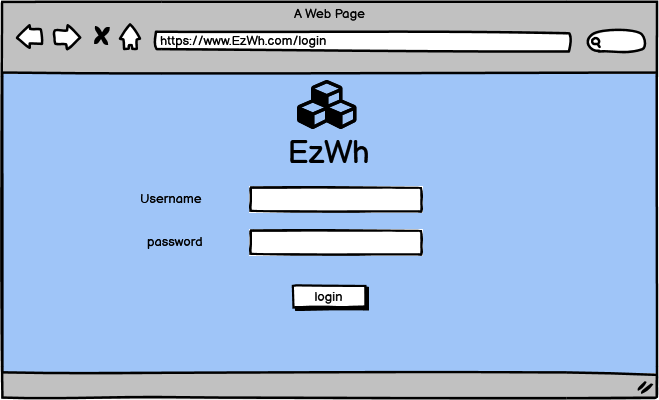

# Graphical User Interface Prototype  

Authors:

Date: 11/04/2022

Version: 1.0

## Generic User
### Login

  
  

    <em>Login</em>
  

   

    <em>Change Password at first Login</em>
  

  
  

    <em>Confirm new password</em>
 

### Settings

  
  

    <em>Homepage</em>
  

   
  

    <em>User Settings</em>
  

  
  

    <em>Username not valid</em>
  

## Manager

### Basics

  
  

    <em>Manager Homepage</em>
  

   
  

    <em>Check orders</em>
  

  
  

    <em>Request Items</em>
  

### Inventory

  
  

    <em>Check Inventory</em>
  

   
  

    <em>Modify Threshold</em>
  

  
  

    <em>Threshold Modified</em>
  

### Orders

  
  

    <em>New Order</em>
  

   
  

    <em>Add Items</em>
  

  
  

    <em>Modify Quantity</em>
  

  
  

    <em>Modify Quantity</em>
  

  
  

    <em>Show new order</em>
  

  
  

    <em>Modify Quantity before submitting</em>
  

  
  

    <em>Confirm Order</em>
  

## Warehouse Administrative

### Basics

  
  

    <em>Administrative Homepage</em>
  

### Manage physical space

  
  

    <em>View warehouse space organization: lanes in section 2</em>
  

   
  

    <em>Add new Lane</em>
  

   
  

    <em>Add new Warehouse and set slot dimension</em>
  

   
  

    <em>Add new Section</em>
  

   
  

    <em>Add new slots</em>
  

### Internal orders

   
  

    <em>Check internal orders</em>
  

  
  

    <em>Set the action "ship" for an internal order already collected</em>
  

### Receive Items

   
  

    <em>Select the order</em>
  

  
  

    <em>Register a new batch arrived</em>
  

  
  

    <em>Set the action "store" for the new batch</em>
  

## Quality Office

   
  

    <em>Homepage</em>
  

### Manage Tests

  
  

    <em>List of defined tests</em>
  

  
  

    <em>View and modify a test</em>
  

  
  

    <em>Create new test</em>
  

  
  

    <em>Set test as passed/not passed</em>
  

## Supplier

   
  

    <em>Homepage</em>
  

### Orders

   
  

    <em>Order List</em>
  

   
  

    <em>Process Order</em>
  

   
  

    <em>Process order - Confirm</em>
  

### Manage prices

   
  

    <em>Prices List</em>
  

   
  

    <em>Modify price</em>
  

   
  

    <em>Modify price - Confirm</em>
  

## Organizational Unit

   
  

    <em>Homepage</em>
  

### Internal orders

  
  

    <em>Order list</em>
  

  
  

    <em>Order details</em>
  

  
  

    <em>New order</em>
  

## System Administrator

### Manage Users

  
  

    <em>Create User</em>
  

  
  

    <em>Delete user</em>
  

## Warehouse Worker

### Manage items

  
  

    <em>Homepage</em>
  

  
  

    <em>Collect item</em>
  

  
  

    <em>Store item</em>
  

