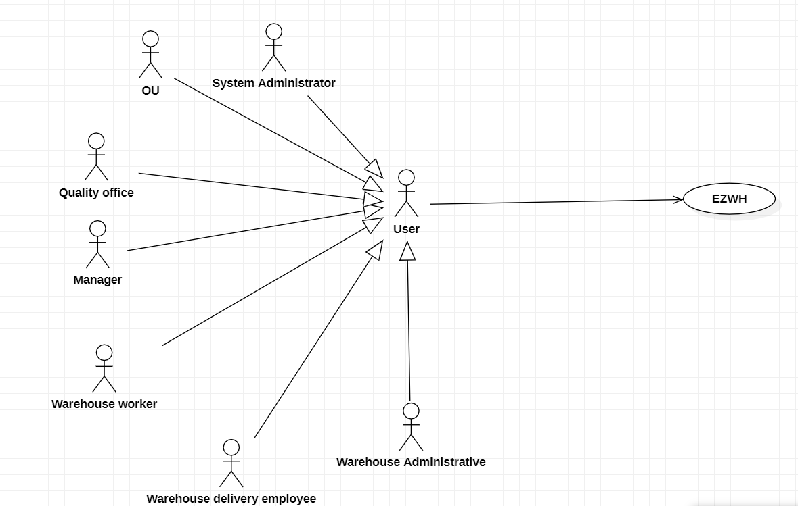
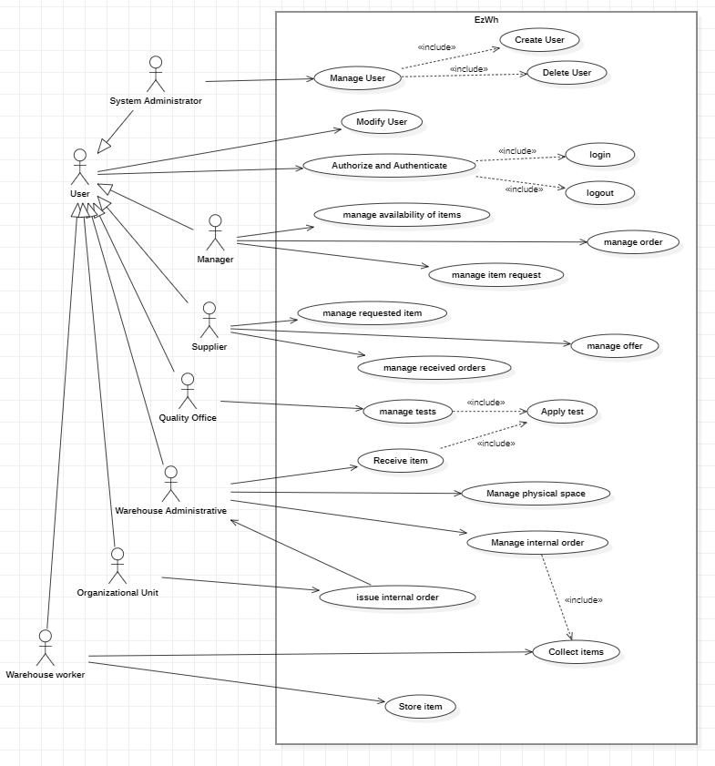

 #Requirements Document 

Date: 22 march 2022

Version: 0.0

 
| Version number | Change |
| ----------------- |:-----------|
| | | 

# Contents

- [Informal description](#informal-description)
- [Stakeholders](#stakeholders)
- [Context Diagram and interfaces](#context-diagram-and-interfaces)
	+ [Context Diagram](#context-diagram)
	+ [Interfaces](#interfaces) 
	
- [Contents](#contents)
- [Informal description](#informal-description)
- [Stakeholders](#stakeholders)
- [Context Diagram and interfaces](#context-diagram-and-interfaces)
	- [Context Diagram](#context-diagram)
	- [Interfaces](#interfaces)
- [Stories and personas](#stories-and-personas)
- [Functional and non functional requirements](#functional-and-non-functional-requirements)
	- [Functional Requirements](#functional-requirements)
	- [Non Functional Requirements](#non-functional-requirements)
- [Use case diagram and use cases](#use-case-diagram-and-use-cases)
	- [Use case diagram](#use-case-diagram)
		- [Use case 1, UC1](#use-case-1-uc1)
				- [Scenario 1.1](#scenario-11)
				- [Scenario 1.2](#scenario-12)
				- [Scenario 1.x](#scenario-1x)
		- [Use case 2, UC2](#use-case-2-uc2)
		- [Use case x, UCx](#use-case-x-ucx)
- [Glossary](#glossary)
- [System Design](#system-design)
- [Deployment Diagram](#deployment-diagram)

# Informal description
Medium companies and retailers need a simple application to manage the relationship with suppliers and the inventory of physical items stocked in a physical warehouse. 
The warehouse is supervised by a manager, who supervises the availability of items. When a certain item is in short supply, the manager issues an order to a supplier. In general the same item can be purchased by many suppliers. The warehouse keeps a list of possible suppliers per item. 

After some time the items ordered to a supplier are received. The items must be quality checked and stored in specific positions in the warehouse. The quality check is performed by specific roles (quality office), who apply specific tests for item (different items are tested differently). Possibly the tests are not made at all, or made randomly on some of the items received. If an item does not pass a quality test it may be rejected and sent back to the supplier. 

Storage of items in the warehouse must take into account the availability of physical space in the warehouse. Further the position of items must be traced to guide later recollection of them.

The warehouse is part of a company. Other organizational units (OU) of the company may ask for items in the warehouse. This is implemented via internal orders, received by the warehouse. Upon reception of an internal order the warehouse must collect the requested item(s), prepare them and deliver them to a pick up area. When the item is collected by the other OU the internal order is completed. 

EZWH (EaSy WareHouse) is a software application to support the management of a warehouse.

# Stakeholders

| Stakeholder name  | Description | 
| ----------------- |:-----------:|
|   Medium companies and retailers |	Need the software application to manage their warehouses	|
|	Managers | Supervises the warehouse and manages orders	|
|	Suppliers	| Need to supply items purchased by the company	|
|	Quality office	|	Performs quality on items and choose whether to return them	|
|	Organizational Unit	|	May request items from the warehouse	|
|	Warehouse worker	|	Tracks the items, the free space and collects the items for delivery	|
|	Warehouse delivery employee	|	Ships internal orders	|
|	Warehouse Administrative | Track incoming and outgoing flow of items |
|	System administrator	|	Manages the functioning of the app	|
| 	Competitors | Other Warehouse Management System |
| 	Warehouse | Physical space available to store items |

# Context Diagram and interfaces

## Context Diagram
<!--\<Define here Context diagram using UML use case diagram>-->

<!--\<actors are a subset of stakeholders>-->

## Interfaces
<!--\<describe here each interface in the context diagram>-->

<!--\<GUIs will be described graphically in a separate document>-->

| Actor | Logical Interface | Physical Interface  |
| ------------- |:-------------:| -----:|
|   Quality Office    | GUI | Screen, keyboard |
|	Manager	|	GUI		|	Screen, keyboard	|
|	Warehouse worker	|	GUI	|	Tablet	|
|	Warehouse delivery employee	|	GUI	|	Tablet	|
|	Warehouse Administrative | GUI | Screen, keyboard |
|	Organizational Unit	| GUI | Screen, keyboard |
|	System administrator | GUI | Screen, keyboard |
| 	Warehouse | ???? |

# Stories and personas
\<A Persona is a realistic impersonation of an actor. Define here a few personas and describe in plain text how a persona interacts with the system>

\<Persona is-an-instance-of actor>

\<stories will be formalized later as scenarios in use cases>

# Functional and non functional requirements

## Functional Requirements

\<In the form DO SOMETHING, or VERB NOUN, describe high level capabilities of the system>

\<they match to high level use cases>

| ID        | Description  |
| ------------- |:-------------:| 
| FR1     | Manage users |
|  	FR1.1     | Create users  |
|	FR1.2	|	Delete users	|
|	FR1.3	|	Modify users	|
| FR2     | Manage item |
|  	FR2.1   | Manage itemDescriptor  |
|  	 FR2.1.1   | Create itemDescriptor  |
|	 FR2.1.2   | Delete itemDescriptor	|
|	 FR2.1.3	| Modify itemDescriptor	|
| 	FR2.2  | Manage physical items |
|  	 FR2.2.1   | Add item  |
|	 FR2.2.2   | Remove item	|
|	 FR2.2.3   | Set position of item |

| FR3  | Manage availability of items |

| FR4 |	Issue order |
| 	FR3.1 | show suppliers per item |
| FR4 | Manage suppliers |
| 	FR4.1 | Insert new Supplier |
| 	FR4.2 | Delete Supplier |
| 	FR4.3 | Associate itemDescriptor with Supplier |
| FR5 | Manage quality check |
|   FR5.1 | Manage test |
|     FR5.1.1 | Describe new test |
|     FR5.1.2 | Modify test |
|     FR5.1.3 | Delete test |
|     FR5.1.4 | Associate test with itemDescriptor |
|   FR5.2 | Apply test |
| 	  FR5.2.1 | Add test result |
| 	  FR5.2.2 | Reject items |
| 	  FR5.2.3 | Accept items |
| FR6 | Manage Warehouse physical space |
| 	FR6.1 | Manage Section |
| 	  FR6.1.1 | Add new Section |
| 	  FR6.1.2 | Delete Section |
| 	FR6.2 | Manage Lane |
| 	  FR6.2.1 | Add new Lane |
| 	  FR6.2.2 | Delete Lane |
| 	FR6.3 | Manage Shelf |
| 	  FR6.2.1 | Add new Shelf |
| 	  FR6.2.2 | Delete Shelf |
| 	FR6.4 | Manage Place |
| 	  FR6.4.1 | Add new Place |
| 	  FR6.4.2 | Delete Place |
| 	  FR6.4.2 | Modify dimension ?????? |

| FR7 | Locate items |

| FR8 | Track free space |

| FR9 | Accept internal order |
| 	FR9.1 | Collect items |
| 	FR9.2 | Ship items |

## Non Functional Requirements

\<Describe constraints on functional requirements>

| ID        | Type (efficiency, reliability, ..)           | Description  | Refers to |
| ------------- |:-------------:| :-----:| -----:|
|  NFR1     | Efficiency  | Memory large enough to store all items | FR2, FR4, FR6 |
|  NFR2     | Efficiency | Response time <1s | For all FR |
|  NFR3     | Usability | Low effort for GUI usability | For all FR |
|  NFR4 | Reliability | Should be available during working hours | For all FR |
|  NFR5 | Maintainability | <1hr to recover from an error | For all FR |
|  NFR6 | Security | Authentication and authorization before all operations | For all FR |
|  NFR7 | Safety | report hazardous material | FR2 FR5 FR8 |

# Use case diagram and use cases

## Use case diagram
\<define here UML Use case diagram UCD summarizing all use cases, and their relationships>

\<next describe here each use case in the UCD>
### Use case 1, UC1
| Actors Involved        |  |
| ------------- |:-------------:| 
|  Precondition     | \<Boolean expression, must evaluate to true before the UC can start> |
|  Post condition     | \<Boolean expression, must evaluate to true after UC is finished> |
|  Nominal Scenario     | \<Textual description of actions executed by the UC> |
|  Variants     | \<other normal executions> |
|  Exceptions     | \<exceptions, errors > |

##### Scenario 1.1 

\<describe here scenarios instances of UC1>

\<a scenario is a sequence of steps that corresponds to a particular execution of one use case>

\<a scenario is a more formal description of a story>

\<only relevant scenarios should be described>

| Scenario 1.1 | |
| ------------- |:-------------:| 
|  Precondition     | \<Boolean expression, must evaluate to true before the scenario can start> |
|  Post condition     | \<Boolean expression, must evaluate to true after scenario is finished> |
| Step#        | Description  |
|  1     |  |  
|  2     |  |
|  ...     |  |

##### Scenario 1.2

##### Scenario 1.x

### Use case 2, UC2
..

### Use case x, UCx
..

# Glossary

\<use UML class diagram to define important terms, or concepts in the domain of the system, and their relationships> 

\<concepts are used consistently all over the document, ex in use cases, requirements etc>

# System Design
\<describe here system design>

\<must be consistent with Context diagram>

# Deployment Diagram 

\<describe here deployment diagram >

