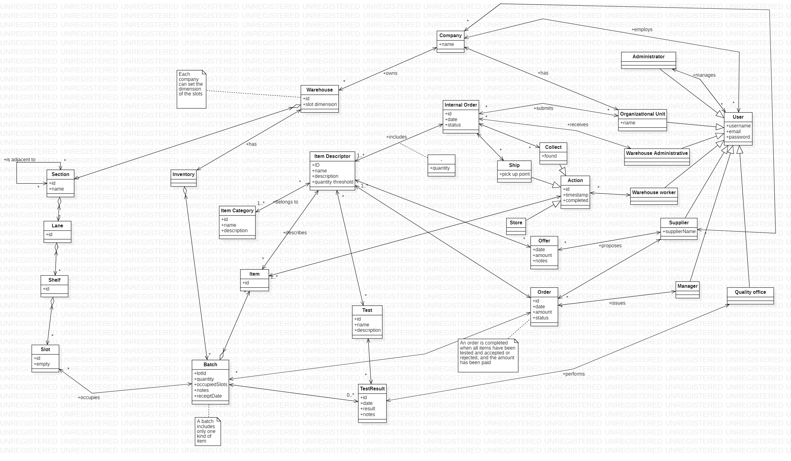
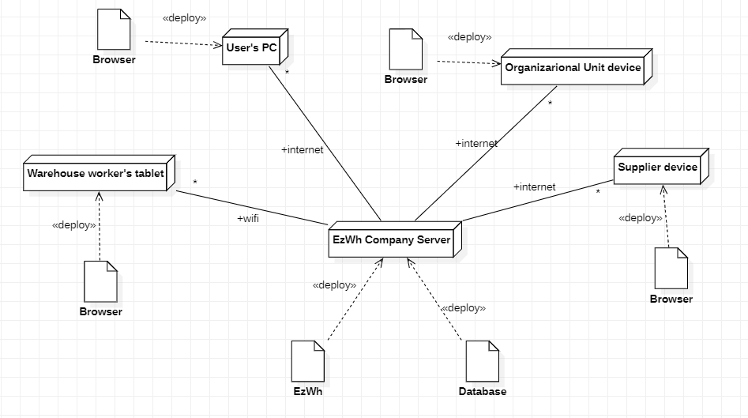

 #Requirements Document 

Date: 22 march 2022

Version: 0.0

 
| Version number | Change |
| ----------------- |:-----------|
| | | 

# Contents

- [Informal description](#informal-description)
- [Stakeholders](#stakeholders)
- [Context Diagram and interfaces](#context-diagram-and-interfaces)
	+ [Context Diagram](#context-diagram)
	+ [Interfaces](#interfaces) 	
- [Contents](#contents)
- [Informal description](#informal-description)
- [Stakeholders](#stakeholders)
- [Context Diagram and interfaces](#context-diagram-and-interfaces)
	- [Context Diagram](#context-diagram)
	- [Interfaces](#interfaces)
- [Stories and personas](#stories-and-personas)
- [Functional and non functional requirements](#functional-and-non-functional-requirements)
	- [Functional Requirements](#functional-requirements)
	- [Non Functional Requirements](#non-functional-requirements)
- [Use case diagram and use cases](#use-case-diagram-and-use-cases)
	- [Use case diagram](#use-case-diagram)
		- [Use case 1 (User - LogIn), UC1](#use-case-1-user---login-uc1)
		- [Use case 2 (User - LogOut), UC2](#use-case-2-user---logout-uc2)
		- [Use case 3 (Manager - Manage availability of items), UC3](#use-case-3-manager---manage-availability-of-items-uc3)
			- [Scenario 3.1](#scenario-31)
			- [Scenario 3.2](#scenario-32)
			- [Scenario 3.3](#scenario-33)
		- [Use case 4 (Manager - Manage item request), UC4](#use-case-4-manager---manage-item-request-uc4)
			- [Scenario 4.1](#scenario-41)
		- [ Use case 5 (Manager - manage orders), UC5](#use-case-5-manager---manage-orders-uc5)
			- [Scenario 5.1](#scenario-51)
			- [Scenario 5.2](#scenario-52)
		- [Use case 6 (Administrative 1 - physical space), UC6](#use-case-6-administrative-1---physical-space-uc6)
			- [Scenario 6.1](#scenario-61)
			- [Scenario 6.2](#scenario-62)
			- [Scenario 6.3](#scenario-63)
			- [Scenario 6.4](#scenario-64)
		- [Use case 7 (Administrative 2 - receive items), UC7](#use-case-7-administrative-2---receive-items-uc7)
			- [Scenario 7.1](#scenario-71)
			- [Scenario 7.2](#scenario-72)
		- [Use case 8 (Administrative 3 - manage internal order), UC8](#use-case-8-administrative-3---manage-internal-order-uc8)
			- [Scenario 8.1](#scenario-81)
		- [Use case 9 (Quality office - apply test), UC9](#use-case-9-quality-office---apply-test-uc9)
			- [Scenario 9.1](#scenario-91)
		- [Use case 10 (Supplier - manage requested items), UC10](#use-case-9-supplier---manage-requested-items-uc9)
			- [Scenario 10.1](#scenario-101)
			- [Scenario 10.2](#scenario-102)
		- [Use case 11 (Supplier - manage offer), UC11](#use-case-11-supplier---manage-offer-uc11)
			- [Scenario 11.1](#scenario-111)
			- [Scenario 11.2](#scenario-112)
		- [Use case 12 (Supplier - manage order list), UC12](#use-case-12-supplier---manage-order-list-uc12)
			- [Scenario 12.1](#scenario-121)
		- [Use case 13 (Organizational Unit - issue internal order), UC13](#use-case-13-organizational-unit---issue-internal-order-uc13)
			- [Scenario 13.1](#scenario-131)
			- [Scenario 13.2](#scenario-132)
		- [Use case 14 (Organizational Unit - show internal order list), UC14](#use-case-14-organizational-unit---show-internal-order-list-uc14)
			- [Scenario 14.1](#scenario-141)
		- [Use case 15 (Organizational Unit - process internal order), UC15](#use-case-15-organizational-unit---process-internal-order-uc15)
			- [Scenario 15.1](#scenario-151)
		- [Use Case 16 (System Administrator - create user), UC16](#use-case-16-system-administrator---create-user-uc16)
			- [Scenario 16.1](#scenario-161)
			- [Scenario 16.2](#scenario-162)
		- [Use Case 17 (System Administrator - modify user), UC17](#use-case-17-system-administrator---modify-user-uc17)
			- [Scenario 17.1](#scenario-171)
			- [Scenario 17.2](#scenario-172)
		- [Use Case 18 (System Administrator - delete user), UC18](#use-case-18-system-administrator---delete-user-uc18)
			- [Scenario 18.1](#scenario-181)
			- [Scenario 18.2](#scenario-182)
		- [Use Case 19 (Warehouse Worker - collect item), UC19](#use-case-19-warehouse-worker---collect-item-uc19)
		- [Use Case 20 (Warehouse Worker - store item), UC20](#use-case-20-warehouse-worker---store-item-uc20)
			- [Scenario 20.1](#scenario-201)
			- [Scenario 20.2](#scenario-202)
- [Glossary](#glossary)
- [System Design](#system-design)
- [Deployment Diagram](#deployment-diagram)

# Informal description
Medium companies and retailers need a simple application to manage the relationship with suppliers and the inventory of physical items stocked in a physical warehouse. 
The warehouse is supervised by a manager, who supervises the availability of items. When a certain item is in short supply, the manager issues an order to a supplier. In general the same item can be purchased by many suppliers. The warehouse keeps a list of possible suppliers per item. 

After some time the items ordered to a supplier are received. The items must be quality checked and stored in specific positions in the warehouse. The quality check is performed by specific roles (quality office), who apply specific tests for item (different items are tested differently). Possibly the tests are not made at all, or made randomly on some of the items received. If an item does not pass a quality test it may be rejected and sent back to the supplier. 

Storage of items in the warehouse must take into account the availability of physical space in the warehouse. Further the position of items must be traced to guide later recollection of them.

The warehouse is part of a company. Other organizational units (OU) of the company may ask for items in the warehouse. This is implemented via internal orders, received by the warehouse. Upon reception of an internal order the warehouse must collect the requested item(s), prepare them and deliver them to a pick up area. When the item is collected by the other OU the internal order is completed. 

EZWH (EaSy WareHouse) is a software application to support the management of a warehouse.

# Stakeholders

| Stakeholder name  | Description | 
| ----------------- |:-----------:|
|   Medium companies and retailers |	Need the software application to manage their warehouses	|
|	Managers | Supervises the warehouse and manages orders	|
|	Suppliers	| Need to supply items purchased by the company	|
|	Quality office	|	Performs quality on items and choose whether to return them	|
|	Organizational Unit	|	May request items from the warehouse	|
|	Warehouse worker	|	Tracks the items, the free space and collects the items for delivery	|
|	Warehouse Administrative | Track incoming and outgoing flow of items |
|	System administrator	|	Manages the functioning of the app	|
| 	Competitors | Other Warehouse Management System |
| 	Warehouse | Physical space available to store items |

# Context Diagram and interfaces

## Context Diagram
<!--\<Define here Context diagram using UML use case diagram>-->

<!--\<actors are a subset of stakeholders>-->

## Interfaces
<!--\<describe here each interface in the context diagram>-->

<!--\<GUIs will be described graphically in a separate document>-->

| Actor | Logical Interface | Physical Interface  |
| ------------- |:-------------:| -----:|
|   Quality Office    | GUI | Screen, keyboard |
|	Manager	|	GUI		|	Screen, keyboard	|
|	Warehouse worker	|	GUI	|	Tablet	|
|	Warehouse Administrative | GUI | Screen, keyboard |
|	Organizational Unit	| GUI | Screen, keyboard |
|	System administrator | GUI | Screen, keyboard |
|	Supplier | GUI | Screen, keyboard |
| 	Warehouse | ???? |

# Stories and personas
\<A Persona is a realistic impersonation of an actor. Define here a few personas and describe in plain text how a persona interacts with the system>

\<Persona is-an-instance-of actor>

\<stories will be formalized later as scenarios in use cases>

## Personas

### Persona 1, P1

Male, middle age, professional, married with children, employed as warehouse worker.

### Persona 2, P2

Female, about 30 years old, single, active and dynamic, employed as sales officer.

## Stories

### Story 1 (P1)

P1 has worked for 30 years as warehouse worker for company C. C decided to buy EzWh. C gives P1 a tablet and creates for him an account as warehouse worker. Initially, P1 is not happy to change the way to do the work he always did, however his interface of EzWh is very simple and clear, so after few months he recognizes that the change was not useless.

### Story 2 (P2)

Company A has bought EzWh, P2 is employed by company B, that produces items needed by A. P2 meets managers of company A to propose her company as supplier of certain products. A system administrator of company A creates for P2 an EzWh account as "Supplier": now P2 can easily view which items are needed by A, make offers for those items, and receive orders from A.

# Functional and non functional requirements

## Functional Requirements

\<In the form DO SOMETHING, or VERB NOUN, describe high level capabilities of the system>

\<they match to high level use cases>

| ID        | Description  |
| :------------- |:-------------:| 
| FR1     | Manage users (System Administrator) |
| &emsp;FR1.1   |   Create users  |
| &emsp;FR1.2	|	Delete users  |
| &emsp;FR1.3	|	Modify users  |
| FR2     | Manage item |
| &emsp;FR2.1   | Manage itemDescriptor  |
| &emsp;&emsp;FR2.1.1   | Create itemDescriptor  |
| &emsp;&emsp;FR2.1.2   | Delete itemDescriptor	|
| &emsp;&emsp;FR2.1.3	| Modify itemDescriptor	|
| &emsp;FR2.2  | Manage physical items |
| &emsp;&emsp;FR2.2.1   | Add item  |
| &emsp;&emsp;FR2.2.2   | Remove item	|
| &emsp;FR2.3 | Manage Batch |
| &emsp;&emsp;FR2.3.1 | Add Batch |
| &emsp;&emsp;FR2.3.2 | Remove Batch |
| &emsp;&emsp;FR2.3.3 | Modify Batch |
| &emsp;FR2.3.4   | Set position of batch |
| FR3  | Manage availability of items (Manager) |
| &emsp;FR3.1 | Show quantity per item |
| &emsp;FR3.2 | Notify when items are under a given quantity threshold |
| &emsp;FR3.3 | Set the quantity threshold |
| FR4 |	Manage order (Manager) |
| &emsp;FR4.1 | Manage item request |
| &emsp;FR4.2 | Show suppliers per item |
| &emsp;FR4.3 | Issue order |
| &emsp;FR4.4 | Complete order |
| &emsp;FR4.5 | Show order status |
| FR5 | Manage suppliers (Supplier) |
| &emsp;FR5.1 |	Manage requested items |
| &emsp;FR5.2 | Manage offer |
| &emsp;&emsp;FR5.2.1 | Add offer |
| &emsp;&emsp;FR5.2.2 | Update offer |
| &emsp;&emsp;FR5.2.3 | Delete offer |
| &emsp;FR5.3 | Show orders |
| FR6 | Manage quality check |
| &emsp;FR6.1 | Manage test |
| &emsp;&emsp;FR6.1.1 | Describe new test |
| &emsp;&emsp;FR6.1.2 | Modify test |
| &emsp;&emsp;FR6.1.3 | Delete test |
| &emsp;&emsp;FR6.1.4 | Associate test with item descriptor |
| &emsp;FR6.2 | Apply test (Quality office) |
| &emsp;&emsp;FR6.2.1 | Add test result |
| &emsp;&emsp;FR6.2.2 | Reject items |
| &emsp;&emsp;FR6.2.3 | Accept items |
| FR7 | Manage Warehouse physical space (Warehouse administrative) |
| &emsp;FR7.1 | Manage Section |
| &emsp;&emsp;FR7.1.1 | Add new Section |
| &emsp;&emsp;FR7.1.2 | Delete Section |
| &emsp;FR7.2 | Manage Lane |
| &emsp;&emsp;FR7.2.1 | Add new Lane |
| &emsp;&emsp;FR7.2.2 | Delete Lane |
| &emsp;FR7.3 | Manage Shelf |
| &emsp;&emsp;FR7.3.1 | Add new Shelf |
| &emsp;&emsp;FR7.3.2 | Delete Shelf |
| &emsp;FR7.4 | Manage Slot |
| &emsp;&emsp;FR7.4.1 | Add new Slot |
| &emsp;&emsp;FR7.4.2 | Delete Slot |
| &emsp;&emsp;FR7.4.2 | Set slot dimension |
| FR8 | Locate items |
| FR9 | Track free space |
| FR10 | Manage internal order |
| &emsp;FR10.1 | Issue internal order (Organizational Unit) |
| &emsp;FR10.2 | Accept internal order (Warehouse Administrative) |
| &emsp;&emsp;FR10.2.1 | Collect items |
| &emsp;&emsp;FR10.2.2 | Ship items |
| &emsp;FR10.3 | Show Internal order status |

## Non Functional Requirements

\<Describe constraints on functional requirements>

| ID        | Type (efficiency, reliability, ..)           | Description  | Refers to |
| ------------- |:-------------:| :-----:| -----:|
|  NFR1     | Efficiency  | Memory large enough to store all items | FR2, FR4, FR6 |
|  NFR2     | Efficiency | Response time less than 1s | For all FR |
|  NFR3     | Usability | Low effort for GUI usability | For all FR |
|  NFR4 | Reliability | Should be available during working hours | For all FR |
|  NFR5 | Maintainability | less than 1hr to recover from an error | For all FR |
|  NFR6 | Security | Authentication and authorization before all operations | For all FR |
|  NFR7 | Safety | report hazardous material | FR2 FR5 FR8 |

# Use case diagram and use cases

## Use case diagram
<!-- \<define here UML Use case diagram UCD summarizing all use cases, and their relationships> -->

### Use case 1 (User - LogIn), UC1
| Actors Involved        | User |
| ------------- |:-------------:| 
|  Precondition     | User U exists |
|  Post condition     | The user has logged in |
|  Nominal Scenario     | U knows Username UN and Password P; U types them in the dedicated fields; the app recognizes the role of U; U logs in the correct page |
|  Variants     | First login; Password forgotten: restore password procedure;  |
|  Exceptions     | U types wrong UN or P, U doesn't exist: access denied |

#### Scenario 3.1
| Scenario 3.1 | |
| ------------- |:-------------:| 
|  Variant Scenario | First login: User must change password |
|  Precondition     | User U exists and first login |
|  Post condition   | The user has logged in and the password changed |
| Step#        | Description  |
|  1     | U enters username and temporary password |  
|  2     | Apps asks to change the password |
|  3	 | U enters twice the new password |
|  4	 | U confirms operation |

### Use case 2 (User - LogOut), UC2
| Actors Involved        | User |
| ------------- |:-------------:| 
|  Precondition     | User U exists and has logged in |
|  Post condition     | The user has logged out |
|  Nominal Scenario     | U selects the aprropriate field to log out |
|  Variants     | None |
|  Exceptions     | None |

### Use Case 3 (User - Modify user), UC3

| Actors Involved        | System Administrator |
| ------------- |:-------------:| 
|  Precondition     | User U exists and loggend in |
|  Post condition   | User U modified |
|  Nominal Scenario | U wants to modify username or password |
|  Variants         | U modifies email |
|  Exception        | new username is not unique |

##### Scenario 3.1

| Scenario 3.1 | |
| ------------- |:-------------:| 
| Variant Scenario | U modifies email | 
| Precondition     | User U exists and loggend in |
| Post condition   | User U email address modified |
| Step#        	   | Description  |
|  1	 | U sets new email |
|  2     | App sends an email to the new address to ask for confirmation |
|  3     | U receives the email and follow the link |
|  4	 | App confirms the new email address | 

##### Scenario 3.2

| Scenario 3.2 | |
| ------------- |:-------------:| 
| Exception Scenario | new username is not unique | 
| Precondition     | User U exists |
| Post condition   | nothing changed |
| Step#        	   | Description  |
|  1	 | U sets new username |
|  2     | App verify that username is already used |
|  3     | App notifies U that username is not unique |
|  4	 | U must choose a different username | 

### Use case 4 (Manager - Manage availability of items), UC4
| Actors Involved        | Manager |
| ------------- |:-------------:| 
|  Precondition      | User U exists and is logged in as "manager"; Inventory I exists |
|  Post condition    | Items have been checked |
|  Nominal Scenario  | U selects item descriptors from list and check availability of items |
|  Variants     	 | U can search by item descriptor's name; U can filter by items with quantity under threshold; U can modify the quantity threshold; |
|  Exceptions     	 | quantity threshold is not valid |

#### Scenario 4.1
| Scenario 4.1 | |
| ------------- |:-------------:| 
|  Nominal Scenario |  |
|  Precondition     | User U exists and is logged in as "manager"; Inventory I exists, Item descriptor A exists |
|  Post condition   | List of items with quantity is showned |
| Step#        | Description  |
|  1     | U selects the procedure to manage availability of items |  
|  2     | App shows the list of all item descriptors in I, with name, id, associated total quantity and current quantity threshold; rows with items with quantity under quantity threshold are highlighted; |
|  3	 | U searches for A by scrolling the list |

#### Scenario 4.2
| Scenario 4.2 |  |
| ------------- |:-------------:| 
|  Variant Scenario | Notify when items are under a given quantity threshold |
|  Precondition     | Item descriptor I exists; a threshold T has been set |
|  Post condition   | U is notified of a low quantity of I |
| Step#        | Description  |
|  1     | The app detects that the quantity of I is lower than T |  
|  2	 | The app notifies U |
|  3 	 | U reads the notification |

#### Scenario 4.3
| Scenario 4.3 |  |
| ------------- |:-------------:| 
|  Variant Scenario | Modify the quantity threshold |
|  Precondition     | Item descriptor I exists |
|  Post condition   | Q is set as quantity threshold for I |
| Step#        | Description  | 
|  1     | U selects the procedure to manage availability of items |  
|  2     | App shows the list of all item descriptors in I, with name, id, associated total quantity and current quantity threshold |
|  3	 | U selects I |
|  4	 | U selects the procedure to set a new T |
|  5 	 | U types the new quantity threshold Q |
|  6	 | U subits the modification |
|  7     | App checks that Q is valid |

### Use case 5 (Manager - Manage item request), UC5
| Actors Involved        | Manager |
| ------------- |:-------------:| 
|  Precondition     | User U exists and is logged in as "manager", list of item descriptors L exists |
|  Post condition   | One or more item descriptors set as requested or not requested |
|  Nominal Scenario | U change the state of one or more item descriptors to requested or not requested |
|  Variants     	| U can search item descriptor inside L by name |
|  Exceptions     	| abort procedure: app asks for confirmation |

##### Scenario 5.1
| Scenario 5.1 |  |
| ------------- |:-------------:| 
| Nominal Scenario | |			
|  Precondition    | User U exists and is logged in as "manager", list of item descriptors L exists, item descriptors A, B exist, A set as not requested and B set as requested |
|  Post condition  | A set as requested (it can be seen by suppliers), B set as not requested (it cannot be seen by suppliers) |
| Step#        | Description  | 
|  1	 | U starts procedure to manage item requests |
|  2	 | App shows L with name, id, quantity, and an editable field to say if item descriptor is requested or not |
|  3	 | U change state of A to requested | 
|  4	 | U change state of B to not requested | 
|  5	 | U subits the procedure |
|  6     | App asks for confirmation |

### Use case 6 (Manager - Manage orders), UC6
| Actors Involved        | Manager |
| ------------- |:-------------:| 
|  Precondition     | User U exists and is logged in as "manager" |
|  Post condition   | N orders created and grouped by N different Supplier |
|  Nominal Scenario | U select one or more offer by different supplier for different items and issue N orders |
|  Variants     	| U can remove an element from the list before submitting the order; U can modify quantity of an element already in the list, before submitting the order; U can check and update the status of existing orders |
|  Exceptions     | U aborts the procedure to create a new order |

##### Scenario 6.1

| Scenario 6.1 |  |
| ------------- |:-------------:| 
|  Nominal Scenario | |
|  Precondition     | User U exists and is logged in as "manager", Item descriptor I exists, Supplier S exists, offer O for I by S exists |
|  Post condition   | N orders created and grouped by N different Supplier |
| Step#        | Description  |
|  1     | U starts procedure to manage orders |
|  2     | U starts procedure to create a new order |
|  3 	 | App shows the current list of items to be ordered with supplier, quantity and total amount (initially list is empty) |
|  4	 | U starts procedure to add items |
|  5     | App shows the list of requested items |
|  6     | U selects I |
|  7	 | App shows the list of all suppliers that made an offer for I, and the associated offer O |
|  8     | U selects O |
|  9     | U sets quantity |
|  10	 | U confirms operation |
|  11 	 | back to Step #3, U can continue to add more offer to the order or continue to step #12 |
|  12	 | U submits the new order | 
|  13	 | App asks for confirmation |
|  14	 | App automatically groups order by N different suppliers, and creates N orders |

##### Scenario 6.2

| Scenario 6.2 |  |
| ------------- |:-------------:| 
|  Variant Scenario | U can check and update the status of existing orders |
|  Precondition     | User U exists and is logged in as "manager", Order O exists |
|  Post condition   | status of O changed to completed |
| Step#        | Description  |
|  1     | U starts procedure to manage orders |
|  2     | U starts procedure to manage existing orders |
|  3 	 | App shows the list of all orders issued by U with orderID, supplier, date and actual status |
|  4	 | U selects order O from list |
|  5     | U set status of O as completed |
|  6     | App asks for confirmation |

### Use case 7 (Warehouse Administrative - Manage physical space), UC7
| Actors Involved        |  Warehouse administrative |
| ------------- |:-------------:| 
|  Precondition     | Warehouse W exists, section S exists, user U exists and is logged in as "Warehouse administrative" |
|  Post condition     | Lane L is created |
|  Nominal Scenario     | U starts procedure to add physical space; from a hyerarchical list U selects the section S; U starts the procedure to add a new lane; the app generates automatically a new id for the lane; U submits the procedure; app asks for confirmation |
|  Variants     | With an equivalent procedure it is possible to add new warehouses, sections, shelves and slots (Precondition: the hyerarchical upper level exists - nothing in case of warehouse -; post condition: the entity is created). Some little differences explained in the scenarios below. When an entity exists, U can also modify its attributes (name, adjacences or slot dimension where present), or delete it. |
|  Exceptions     | U aborts procedure |

##### Scenario 7.1

| Scenario 7.1 | |
| ------------- |:-------------:| 
|  Variant Scenario | Add new warehouse |
|  Precondition     | User U exists and is logged in as "Warehouse administrative" |
|  Post condition     | Warehouse W is created |
| Step#        | Description  |
|  1     | U starts the procedure to add a new warehouse |
|  2     | The app generates automatically a new id for the warehouse |
|  4     | U sets the dimension of warehouse's slots |
|  5     | U submits the procedure |
|  6	 | app asks for confirmation |

##### Scenario 7.2 

| Scenario 7.2 | |
| ------------- |:-------------:|
|  Variant Scenario | Add new section | 
|  Precondition     | Warehouse W exists, user U exists and is logged in as "Warehouse administrative" |
|  Post condition     | Section S is created |
| Step#        | Description  |
|  1     | U selects warehouse W |  
|  2     | U starts the procedure to add a new section |
|  3     | The app generates automatically a new id for the section |
|  4     | U set the name of S |
|  5     | U selects a list of adjacent sections |
|  6     | U submits the procedure |
|  7	 | app asks for confirmation |

##### Scenario 7.3

| Scenario 7.3 | |
| ------------- |:-------------:| 
|  Variant Scenario | Add new slots | 
|  Precondition     | Warehouse W, Section S, Lane L and Shelf A exist, user U exists and is logged in as "Warehouse administrative" |
|  Post condition     | A has 100 new slots |
| Step#        | Description  |
|  1     | U selects Shelf A |  
|  2     | U starts the procedure to add new slots |
|  3     | U selects the number of new slots: 100 |
|  4     | The app generates automatically new id for the slots |
|  5     | U submits the procedure |
|  6	 | app asks for confirmation |

##### Scenario 7.4

| Scenario 7.4 | |
| ------------- |:-------------:|
|  Variant Scenario | Delete a Shelf | 
|  Precondition     | Shelf A exists, A contains no slots or empty slots, user U exists and is logged in as "Warehouse administrative" |
|  Post condition     | A is deleted |
| Step#        | Description  |
|  1     | U selects shelf A |
|  2     | U selects the option "delete" |
|  4     | The app asks for confirmation |
|  5     | U confirms |

### Use case 8 (Warehouse Administrative - Receive items), UC8
| Actors Involved        |  Warehouse administrative |
| ------------- |:-------------:| 
|  Precondition     | Order O to supplier S exists and is PENDING, batch B of items descripted by item descriptor D arrived to warehouse, user U exists and is logged in as "Warehouse administrative" |
|  Post condition     | B is ready to be stored |
|  Nominal Scenario     | U checks that kind and quantity of items are compliant with O; U registers B and the items in it; U sees that D needs the test T; U sends B to the Quality Office; U waits for test result; U is notified that T has been passed; U sets the action "store" for the items included in B and a warehouse worker. |
|  Variants     | no need of test for B |
|  Exceptions   | B not compliant with O: Items are not even registered, U calls a manager to handle the situation. B does not pass a test: B is marked as refused and is not stored, the return to the supplier is not handled by EzWh app. |

##### Scenario 8.1

| Scenario 8.1 |  |
| ------------- |:-------------:| 
|  Nominal Scenario | |
|  Precondition     | Order O to supplier S exists and is PENDING, batch B of items descripted by item descriptor D arrived to warehouse, user U exists and is logged in as "Warehouse administrative, a test T for D exists |
|  Post condition   | B is ready to be stored |
| Step#        | Description  |
|  1     | U checks that kind and quantity of items are compliant with O |
|  2     | U registers B and the items in it |
|  3 	 | U sends B to the Quality Office |
|  4	 | U waits for test result |
|  5     | U is notified that T has been passed |
|  6     | U sets the action "store" for the items included in B and a warehouse worker |

##### Scenario 8.2

| Scenario 8.2 |  |
| ------------- |:-------------:| 
|  Variant Scenario | no need to apply test to B |
|  Precondition     | Order O to supplier S exists and is PENDING, batch B of items descripted by item descriptor D arrived to warehouse, user U exists and is logged in as "Warehouse administrative, a test T for D exists |
|  Post condition   | B is ready to be stored |
| Step#        | Description  |
|  1     | U checks that kind and quantity of items are compliant with O |
|  2     | U registers B and the items in it |
|  6     | U sets the action "store" for the items included in B and a warehouse worker |

### Use case 9 (Warehouse Administrative - Manage internal order), UC9
| Actors Involved        |  Warehouse administrative |
| ------------- |:-------------:| 
|  Precondition    | Organizational Unit OU has issued an internal order IO, user U exists and is logged in as "Warehouse administrative" |
|  Post condition   | Requested items are ready at the pick up point |
|  Nominal Scenario | U manages the actions collect and ship of IO |
|  Variants    		| If IO is large, U can set more than one action "collect" or "ship", involving different warehouse workers |
|  Exceptions     	| Some of requested items not present: U can decide if send immediately the present ones and complete IO later with the missing ones, or freeze the whole order until all items are available |

##### Scenario 9.1

| Scenario 9.1 |  |
| ------------- |:-------------:| 
|  Nominal Scenario | |
|  Precondition     | Organizational Unit OU has issued an internal order IO, user U exists and is logged in as "Warehouse administrative" |
|  Post condition   | Requested items are ready at the pick up point |
| Step#        | Description  |
|  1     | U selects IO |
|  2     | U checks that all the item requested are present in the warehouse |
|  3 	 | U sets the action "collect" associated to IO and a warehouse worker |
|  4	 | U waits until the action is completed |
|  5     | U sets the action "ship" for IO and another warehouse worker |
|  6     | U is notified that the action has been completed |

### Use case 10 (Quality office - Apply test), UC10
| Actors Involved        |  Quality office |
| ------------- |:-------------:| 
|  Precondition     | Batch B arrived in quality office, B is registered, test T exists, user U exists and is logged in as "Quality office" |
|  Post condition     | B is accepted |
|  Nominal Scenario   | U manages test result for batch B |
|  Variants     	  | Test not passed: same as Scenario 8.1 but at point 4 U selects "not passed". U can define a new test for the descriptor D of items included in B, modify the description of a test or delete it |
|  Exceptions     | B is not registered: T cannot be applied (U returns B to administrative office, where it should have been before it arrived at quality office). |

##### Scenario 10.1

| Scenario 10.1 |  |
| ------------- |:-------------:| 
|  Nominal Scenario | |
|  Precondition     | Batch B arrived in quality office, B is registered, test T exists, user U exists and is logged in as "Quality office"  |
|  Post condition   | B is accepted |
| Step#        | Description |
|  1     | U selects the batch B |
|  2     | App shows list of tests needed for B, with description |
|  3	 | U selects the test T |
|  4 	 | after the test has been executed, U selects "passed" |
|  5	 | U submits the test result |
|  6     | U sets the action "ship" for IO and another warehouse worker |
|  7     | U is notified that the action has been completed |

##### Scenario 10.2

| Scenario 10.2 |  |
| ------------- |:-------------:| 
|  Variant Scenario | U can define a new test for the item descriptor D of items included in B|
|  Precondition     | user U exists and is logged in as "Quality office"  |
|  Post condition   | a new T is created for D |
| Step#        | Description |
|  1     | U starts procedure to create new test |
|  2     | App shows list of all item descriptors |
|  3 	 | U selects D from list |
|  4	 | U starts procedure to add new test T |
|  5     | U adds description for T |
|  6     | U confirms the operation |

### Use case 11 (Supplier - Manage requested items), UC11
| Actors Involved        | Supplier |
| ------------- |:-------------:| 
|  Precondition     | User U exists and is logged in as "Supplier", List L of item descriptors set as requested exists |
|  Post condition   | associated or not item descriptor D to user U |
|  Nominal Scenario | App shows L of items descriptor needed by the company, user U selects I that can supply |
|  Variants     	| User U searches the item descriptor D by its name; U does not provides I anymore: U deletes I from the list |
|  Exceptions     	| user U aborts the operation |

##### Scenario 11.1

| Scenario 11.1 | |
| ------------- |:-------------:| 
| Nominal Scenario | | 
| Precondition     | User U exists and is logged in as "Supplier", List L of item descriptors set as requested exists |
| Post condition   | Associated one or more item descriptor D to user U |
| Step#        	   | Description  |
|  1	 | User starts procedure to manage requested items |
|  3     | App shows L with item descriptor name | 
|  4     | User U sets the item descriptor D from L as available to supply | 
|  5     | User U confirms operation |

##### Scenario 11.2

| Scenario 11.2 | |
| ------------- |:-------------:| 
| Variant Scenario | User U exists and is logged in as "Supplier", List L of item descriptors set as requested exists, item descriptor D already setted as available to supply |
| Precondition     | User U authenticated and authorized  as "Supplier" |
| Post condition   | Removed association of one or more item descriptor D to user U |
| Step#        	   | Description  |
|  1	 | User starts procedure to manage requested items |
|  3     | App shows L with item descriptor name, D is already shown as available to supply | 
|  4     | User U deselect the item descriptor D from L as available to supply | 
|  5     | User U confirms operation |

### Use case 12 (Supplier - Manage offer), UC12
| Actors Involved        | Supplier |
| ------------- |:-------------:| 
|  Precondition     | User U exists and is logged in as "Supplier", item descriptor I exists and set as requested |
|  Post condition   | Offer O is created, updated or deleted for I |
|  Nominal Scenario | U selects I from a list and manages an Offer O for I |
|  Variants     	| U can filter item descriptor by name; an offer O for I already exists: U can update or delete O |
|  Exceptions     	| user U aborts the operation: app asks for confirmation |

##### Scenario 12.1
| Scenario 12.1 |  |
| ------------- |:-------------:| 
| Nominal Scenario | |			
|  Precondition    | User U exists and is logged in as "Supplier", item descriptor I exists and set as requested, no offer already existing for I |
|  Post condition  | Offer O is created for I |
| Step#        | Description  | 
|  1	 | U starts procedure to manage offers |
|  2	 | app shows the list of I requested by the company and a field to manage offers |
|  3	 | U selects I |
|  4	 | U starts procedure to manage an offer O for I|
|  5     | U sets the amount for O |
|  6 	 | app checks that amount is valid |
|  7	 | U confirms operation |

##### Scenario 12.2
| Scenario 12.2 |  |
| ------------- |:-------------:| 
| Variant Scenario | U update an offer already existing for I |
|  Precondition    | User U exists and is logged in as "Supplier", item descriptor I exists and set as requested, an offer O already exists for I |
|  Post condition  | Offer O is updated for I |
| Step#        | Description  | 
|  1	 | U starts procedure to manage offers |
|  2	 | app shows the list of I requested by the company and a field to manage offers |
|  3	 | U selects I |
|  4	 | U starts procedure to manage an offer O for I|
|  5	 | App shows the existing offer |
|  5     | U sets the new amount for O |
|  6 	 | app checks that amount is valid |
|  7	 | U confirms operation |

### Use case 13 (Supplier - Manage order list), UC13
| Actors Involved        | Supplier |
| ------------- |:-------------:| 
|  Precondition     | User U exists and is logged in as "Supplier", List L of orders exists |
|  Post condition   | list of user orders showed, order O changed |
|  Nominal Scenario | User U start procedure to show order list; App shows L of all orders of U with orderID, date, status and Quality 						  Check problems; |
|  Variants     	| User U can filter L by status; U can process an order O |
|  Exceptions	  	| None |

##### Scenario 13.1

| Scenario 13.1 | |
| ------------- |:-------------:| 
| Variant Scenario | User U process order O | 
| Precondition     | User U exists and is logged in as "Supplier", list of orders L exists |
| Post condition   | One or more items of order O set as delivered |
| Step#        	   | Description |
|  1	 | User U start procedure to show order list L |
|  2 	 | U selects an order O from L | 
|  3     | U start procedure to process order O | 
|  4	 | App shows a list of all items of the order O with quantity and a delivered field (already delivered item rows are disabled)|
|  5	 | U checks one or more item(s) as delivered |
|  6	 | U confirms operation |

### Use case 14 (Organizational Unit - Issue internal order), UC14
| Actors Involved        | Organizational Unit |
| ------------- |:-------------:| 
|  Precondition     | User U exists and is logged in as "Organizational Unit", Inventory I exists |
|  Post condition   | New internal order IO issued |
|  Nominal Scenario | User U selects item descriptors from inventory I, add quantity and issue order IO |
|  Variant Scenario | User U searches item descriptor I by its name; U filters I by item category | 
|  Exceptions     	| user U aborts the operation, quantity invalid |

##### Scenario 14.1

| Scenario 14.1 | |
| ------------- |:-------------:| 
| Nominal Scenario | | 
| Precondition     | User U exists and is logged in as "Organizational Unit", Inventory I exists |
| Post condition   | New internal order IO issued |
| Step#        	   | Description  |
|  1	 | U starts procedure to issue a new internal order IO |
|  2	 | A list of all item descriptors in I of the Warehouse is shown with itemID, item name and category |
|  3	 | User U sets the quantity to one or more item descriptor(s) in the list |
|  4     | User U confirms operation |
|  5	 | App checks that the quantity input fields are valid|

##### Scenario 14.2

| Scenario 14.2 | |
| ------------- |:-------------:| 
| Exception Scenario | Quantity value checks failed | 
| Precondition     | User U exists and is logged in as "Organizational Unit", Inventory I exists |
| Post condition   | Wrong input field are highlighted |
| Step#        	   | Description |
|  1	 | A list of all items in the inventory of the Warehouse is shown with itemID, item name and Category |
|  2	 | User U sets quantity to one or more item(s) |
|  3     | User U confirms operation |
|  4	 | One or more quantity input fields checks are failed |
|  5     | Input fields with error are highlighted |

### Use case 15 (Organizational Unit - Show internal order list), UC15
| Actors Involved        | Organizational Unit |
| ------------- |:-------------:| 
|  Precondition     | User U exists and is logged in as "Organizational Unit" |
|  Post condition   | List of user U orders showed |
|  Nominal Scenario | Show list of all orders of the user U |
|  Variants     	| Show list of orders filtered by status; U can see list of item descriptor |
|  Exception 		| None |

##### Scenario 15.1

| Scenario 15.1 | |
| ------------- |:-------------:| 
| Nominal Scenario | | 
| Precondition     | User U exists and is logged in as "Organizational Unit" |
| Post condition   | List of all user U orders showed |
| Step#        	   | Description  |
|  1	 | U starts the procedure to show the list of all internal orders |
|  2	 | App shows a list of all user U orders with orderID, date and order status |
|  3     | User can scroll list to see all orders |

### Use case 16 (Organizational Unit - Process internal order), UC16
| Actors Involved        | Organizational Unit |
| ------------- |:-------------:| 
|  Precondition     | User U exists and is logged in as "Organizational Unit" |
|  Post condition   | Items of an orders set as delivered |
|  Nominal Scenario | User U selects order O from order list and process order O |
|  Variant Scenario | None |
|  Exceptions     	| User U aborts the operation |

##### Scenario 16.1

| Scenario 16.1 | |
| ------------- |:-------------:| 
| Nominal Scenario | | 
| Precondition     | User U exists and is logged in as "Organizational Unit" |
| Post condition   | Items of order O set as delivered |
| Step#        	   | Description  |
|  1	 | U starts the procedure to show the list of all internal orders |
|  2	 | App shows a list of all user U orders with orderID, date and order status |
|  3	 | U selects an order O |
|  4     | U starts procedure to see order details of O | 
|  5	 | A list of all items of O is shown with quantity and a delivered field (already delivered item rows are disabled) |
|  6	 | User U checks one or more item(s) as delivered |
|  7	 | User U confirms operation |

### Use Case 17 (System Administrator - Create user), UC17

| Actors Involved        | System Administrator |
| ------------- |:-------------:| 
|  Precondition     | User SA exists and is logged in as "System Administrator", User U not defined in the system |
|  Post condition   | User U created |
|  Nominal Scenario | SA create User U given its username, email and password; SA specifies which role U has with eventually additional parameters |
|  Variants         | None |
|  Exception        | Username already exists |

##### Scenario 17.1

| Scenario 17.1 | |
| ------------- |:-------------:| 
| Nominal Scenario | | 
| Precondition     | User SA exists and is logged in as "System Administrator", User U not defined in the system |
| Post condition   | User U created |
| Step#        	   | Description  |
|  1	 | SA retrieves username, email and role about a user |
|  2     | SA creates a user U with username and email |
|  3	 | SA sets role for U |
|  4     | SA sets a temporary password for U |
|  5	 | SA confirms operation |

### Use Case 18 (System Administrator - Delete user), UC18

| Actors Involved        | System Administrator |
| ------------- |:-------------:| 
|  Precondition     | User SA exists and is logged in as "System Administrator", User U exists |
|  Post condition   | User U deleted |
|  Nominal Scenario | System Administrator SA wants to delete a User given its username |
|  exception        | U username is not present |

##### Scenario 18.1

| Scenario 18.1 | |
| ------------- |:-------------:| 
| Nominal Scenario | | 
| Precondition     | User SA exists and is logged in as "System Administrator", User U exists |
| Post condition   | User U deleted |
| Step#        	   | Description  |
|  1	 | SA retrieves user by its username |
|  2     | SA delete the user |
|  3	 | App asks for confirmation |

#### Scenario 18.2

| Scenario 18.2 | |
| ------------- |:-------------:| 
| Exception Scenario | U username is not present | 
| Precondition     | User SA exists and is logged in as "System Administrator", User U exists |
| Post condition   | nothing changed |
| Step#        	   | Description  |
|  1	 | SA retrieves user by its username |
|  2     | SA doesn't find the user |

### Use Case 19 (Warehouse Worker - Collect item), UC19

| Actors Involved        | Warehouse Worker |
| ------------- |:-------------:| 
|  Precondition     | User U exists and is logged in as "Warehouse Worker", Item I exists and located |
|  Post condition   | item I collected |
|  Nominal Scenario | U collects the item found |
|  exception        | item was not found |

##### Scenario 19.1

| Scenario 19.1 | |
| ------------- |:-------------:| 
| Nominal Scenario | | 
| Precondition     | User U exists and is logged in as "Warehouse Worker", Item I exists and located |
| Post condition   | item I collected |
| Step#        	   | Description  |
|  1	 | U is notified to collect I |
|  2     | App shows the position of I in the Warehouse |
|  3	 | U sets the action as completed |

##### Scenario 19.2

| Scenario 19.2 | |
| ------------- |:-------------:| 
| Exception Scenario | item was not found | 
| Precondition     | User U exists and is logged in as "Warehouse Worker", Item I exists and located |
| Post condition   | nothing change |
| Step#        	   | Description  |
|  1	 | U is notified to collect I |
|  2     | App shows the position of I in the Warehouse |
|  3	 | U set I as not found |
|  4	 | U sets the action as completed and exception is handled externally of EzWH |

### Use Case 20 (Warehouse Worker - Store item), UC20

| Actors Involved        | Warehouse Worker |
| ------------- |:-------------:| 
|  Precondition     | User U exists and is logged in as "Warehouse Worker", item I exists and not stored, position P (set of free slots) located |
|  Post condition   | item stored |
|  Nominal Scenario | U stores I in P |
|  Variant			| Store a whole batch instead of a single I |
|  Exception        | none |

##### Scenario 20.1

| Scenario 20.1 | |
| ------------- |:-------------:| 
| Nominal Scenario | | 
| Precondition     | User U exists and is logged in as "Warehouse Worker", item I exists and not stored, position P (set of free slots) located |
| Post condition   | item stored |
| Step#        	   | Description  |
|  1	 | U is notified to store I |
|  2     | App shows P |
|  3	 | U sets the action as completed |

# Glossary
<!--
\<use UML class diagram to define important terms, or concepts in the domain of the system, and their relationships> 

\<concepts are used consistently all over the document, ex in use cases, requirements etc>
-->

# System Design
<!--
\<describe here system design>

\<must be consistent with Context diagram>
-->

As EzWh is a completely software product, no system design is needed.

# Deployment Diagram 
<!-- \<describe here deployment diagram > -->

